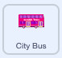

## إنشاء مشهد الحافلة الخاص بك

<div style="display: flex; flex-wrap: wrap">
<div style="flex-basis: 200px; flex-grow: 1; margin-right: 15px;">
ستختار خلفية وتضيف كائن حافلة.
</div>
<div>

! [حافلة المدينة على خلفية المدرسة.] (images / bus-scene.png) {: width = "300px"}

</div>
</div>

### افتح مشروع البداية

--- task ---

افتح [المشروع الابتدائي للحاق بالحافلة](https://scratch.mit.edu/projects/582214330/editor){:target="_blank"}. سيتم فتح Scratch في علامة تبويب متصفح أخرى.

[[[working-offline]]]

--- /task ---

### اختر خلفية

--- task ---

انقر (أو على جهاز لوحي ، اضغط) على **اختر خلفية** في جزء المنصة (في الركن الأيمن السفلي من الشاشة):


--- /task ---

--- task ---

انقر فوق أيقونة **الخلفية**. أضف خلفية تشكل نقطة انطلاق جيدة لحافلتك:


--- /task ---

### اختر كائن

--- task ---

انقر فوق **اختر كائن**:


--- /task ---

--- task ---

اكتب `حافلة` في مربع البحث في الأعلى:


أضف **حافلة المدينة** إلى مشروعك.

--- /task ---

### عندما تسحب الحافلة ، تذهب أمام كائن القطة.

--- task ---

تأكد من تحديد **حافلة مدينة** في قائمة كائن أسفل المنصة.

اسحب كتلة `عند نقر العلم الأخضر`{:class="block3events"} من قائمة كتلة `الاحداث`{:class="block3motion"} الى مساحة التعليمات البرمجية:



```blocks3
when flag clicked
```

--- /task ---

--- task ---

اسحب الحافلة إلى موضع جيد على المنصة:


يتم عرض احداثيات **س** و **ص** (الأرقام المستخدمة لوصف الموضع) للحافلة في جزء الرموز أسفل المنصة:


--- /task ---

--- task ---

أضف كتلة `اذهب إلى س: ص:`{:class="block3motion"}:


```blocks3
when flag clicked
+go to x: (0) y: (-100)
```

الأرقام الموجودة في كتلة `اذهب إلى س: ص:`{:class="block3motion"} هي إحداثيات س و ص الحالية للحافلة. قد تكون الأرقام في مشروعك مختلفة بعض الشيء.

--- /task ---

--- task ---

**اختبار:** اسحب الحافلة إلى أي مكان على المنصة ، ثم انقر فوق العلم الأخضر. يجب أن تذهب الحافلة دائمًا إلى موضع البداية.


--- /task ---

### حرك الحافلة خلف الكائنات

--- task ---

للتأكد من أن كائن **City Bus** دائمًا ما يكون خلف جميع الكائنات`انتقل إلى الطبقة الأمامية`{:class="block3looks"} ، ثم انقر على `الأولى`{:class="block3looks"} وقم بتغييره إلى `رجوع`{:class="block3looks"}:


```blocks3
when flag clicked
go to x: (0) y: (-100)
+ go to [back v] layer
```

**نصيحة:** إذا لم تتمكن من رؤية `انتقل إلى`{:class="block3looks"} ، فأنت بحاجة إلى التمرير لأسفل في `الھیئة`{:class="block3looks"}.

--- /task ---

### تغيير لون الحافلة

--- task ---

يمكنك تغيير لون الحافلة:


```blocks3
when flag clicked
go to x: (0) y: (-100)
go to [back v] layer
+set [color v] effect to (50) // try numbers up to 200
```

--- /task ---

### تغيير حجم قطة Scratch

--- task ---

يظهر كائن القطة في جميع مشاريع Scratch الجديدة كـ **Sprite1** في قائمة الكائن. انقر فوق **Sprite1** في قائمة الكائن للاستعداد لتحريك القطة:


**نصيحة:** إذا قمت بحذف **Sprite1** (كائن القطة)، بامكانك الضغط على **اختر كائن** والبحث عن `cat`.

--- /task ---

--- task ---

في جزء كائن ، انقر فوق **الحجم** وقم بتغيير حجم القطة إلى `50`:


--- /task --- 
