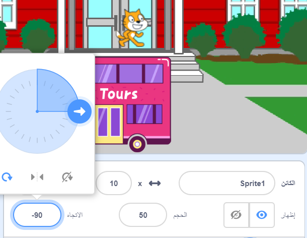
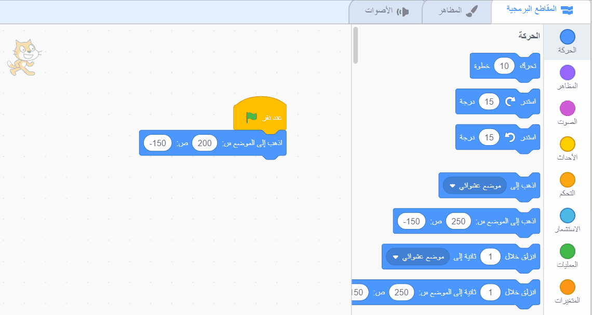

## قط سكراتش يلحق بالحافلة

<div style="display: flex; flex-wrap: wrap">
<div style="flex-basis: 200px; flex-grow: 1; margin-right: 15px;">
سوف تقوم بتحريك القطة لتظهر على **الجانب الأيمن** من المنصة والمشي إلى الحافلة بتكرار حركة صغيرة عدة مرات في **حلقة**. 
</div>
<div>

{:width="300px"}

</div>
</div>

### اجعل كائن القط في وضع البداية

--- task ---

انقر فوق **الاتجاه** في جزء كائن. تدوير السهم للإشارة إلى `-90`. بعد ذلك ، انقر على **يسار / يمين** في المنتصف لتغيير نمط الدوران إلى `يسار - يمين` لإيقاف القط رأسًا على عقب:



--- /task ---


--- task ---

اسحب القط إلى أسفل الجانب الأيمن من المنصة.

**نصيحة:** إذا حاولت وضع كائن بعيدًا عن المنصة ، فسوف يعود إلى آخر موضع له على المنصة.

--- /task ---

--- task ---

أضف تعليمة برمجية لإحضار القط إلى موضع البداية:


```blocks3
when flag clicked
go to x:(200) y:(-150) // أسفل الجانب الأيمن
```

--- /task ---

--- task ---

**اختبار:** اسحب القط إلى موضع جديد ، ثم انقر فوق `انتقل إلى كتلة x: y:`{:class="block3motion"}. يجب أن يعود القط إلى الجانب الأيمن السفلي في كل مرة.

--- /task ---

### تحريك القط

ستضيف تعليمة برمجية في حلقة `كرِّر مرة`{:class="block3control"} لتجعل القط يكرر عددًا صغيرًا من الخطوات عدة مرات. هذا سيجعل القط يظهر متحركًا.

--- task ---

أضف `كرِّر مرة`{:class="block3control"} `10` ، ثم اسحب كتلة `حركة`{:class="block3motion"} كتلة `10` `خطوات`{:class="block3motion"} بداخلها:




```blocks3
when flag clicked
go to x:(200) y:(-150) // أسفل الجانب الأيمن
+ repeat (10) // جرب أرقامًا مختلفة
move (5) steps //  5 هي سرعة مشي جيدة
end
```

--- /task ---

--- task ---

**اختبار:** انقر فوق العلم الأخضر. حاول تغيير الأرقام بحيث يتوقف القط في الحافلة.

--- /task ---

تحتوي بعض الكائنات على أكثر من زي واحد. سوف تستخدم **Scratch Cat** sprite لإنشاء رسم متحرك لمشي Scratch Cat.

--- task ---

انقر فوق علامة التبويب **الأزياء**. **كائن القط** له زيان ، ويمكن استخدامهما معًا للقيام بحركة المشي.

--- /task ---

--- task ---

انقر فوق علامة التبويب **لمقاطع البرمجیة**. أضف `الزي التالي`{:class="block3looks"}:


```blocks3
when flag clicked
go to x:(200) y:(-150) // أسفل الجانب الأيمن
repeat (20) // جرب أرقامًا مختلفة
move (5) steps //  5 هي سرعة مشي جيدة
+ next costume 
end
```
--- /task ---

--- task ---

**اختبار:** انقر فوق العلم الأخضر ، وسيقوم القط بالسير إلى الحافلة.

--- /task ---

الآن ، ستجعل القط يبدو وكأنه يدخل الحافلة.

--- task ---

أضف كتلة إلى `إخفاء`{:class="block3looks"} القط عند وصولهم إلى الحافلة:


```blocks3
when flag clicked
go to x:(200) y:(-150) // أسفل الجانب الأيمن
repeat (20) // جرب أرقامًا مختلفة
move (5) steps //  5 هي سرعة مشي جيدة
next costume 
end
+ hide
```

--- /task ---

--- task ---

**اختبار:** انقر فوق العلم الأخضر مرة أخرى ، وسترى أن القط قد اختفى الآن.

--- /task ---

يحتاج القط إلى الظهور مرة أخرى عند تشغيل الرسوم المتحركة مرة أخرى.

--- task ---

أضف `اظهر`{:class="block3looks"} بحيث تظهر القطة قبل أن يمشوا إلى الحافلة:


```blocks3
when flag clicked
go to x:(200) y:(-150) // أسفل الجانب الأيمن
+ show
repeat (20) // جرب أرقامًا مختلفة
move (5) steps //  5 هي سرعة مشي جيدة
next costume 
end
hide
```

**نصيحة:** عند استخدام `إخفاء`{:class="block3looks"} ، تحتاج أيضًا إلى إضافة كتلة `اظهر`{:class="block3looks"} للتأكد من أن الكائن مرئي عند الحاجة أن تكون.

--- /task ---

--- task ---

**اختبار:** انقر فوق العلم الأخضر لاختبار مشروعك ، وتأكد من ظهور القط.

--- /task ---

--- save ---
