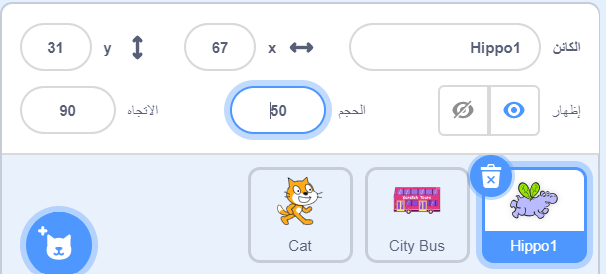

## فرس النهر يطير إلى الحافلة

<div style="display: flex; flex-wrap: wrap">
<div style="flex-basis: 200px; flex-grow: 1; margin-right: 15px;">
ستضيف كائن فرس النهر الذي يطير إلى الحافلة.
</div>
<div>

! [فرس النهر يطير إلى الحافلة.] (images / hippo-flies.png) {: width = "300px"}

</div>
</div>

### اعطي فرس النهر وضعية البداية

--- task ---

أضف الكائن **فرس النهر** إلى مشروعك.

تغيير **الحجم** لـكائن **فرس النهر**:



--- /task ---

--- task ---

اسحب فرس النهر إلى أعلى الجانب الأيسر من المنصة.


--- /task ---

--- task ---

أضف الكود لإيصال فرس النهر إلى موضع البداية:

```blocks3
when flag clicked
go to x: [-200] y: [150] // top left-hand side
```

**نصيحة:** سيكون موضع `س`{:class="block3motion"} و `ص`{:class="block3motion"} في الجزء `انتقل إلى الموضع س: ص:`{:class="block3motion"} الموقع الحالي لفرس النهر ، لذلك لا تحتاج إلى كتابته.

--- /task ---

### اجعل فرس النهر يرفرف بجناحيه ويطير

--- task ---

أضف الكود لجعل فرس النهر يطير باتجاه **باص المدينة**:

```blocks3
when flag clicked
go to x: [-200] y: [150] 
+repeat [100] 
point towards (City Bus v) // change from mouse-pointer
move [3] steps
next costume
+end
```

--- /task ---

--- task ---

**اختبار:** انقر على العلم الأخضر وتأكد من أن فرس النهر يطير إلى الحافلة. يمكنك تغيير الرقم في `تكرار`{:class="block3control"} لإيقاف فرس النهر في المكان الصحيح تمامًا.

--- /task ---

### إظهار وإخفاء الحافلة

--- task ---

أضف `إظهر`{:class="block3looks"} و `إختف`{:class="block3looks"}:

```blocks3
when flag clicked
go to x: [-200] y: [150] 
+ show
repeat [90] 
point towards (City Bus v)
move [3] steps
next costume
end
+ hide
```

--- /task ---

--- task ---

**اختبار:** انقر فوق العلم الأخضر. سوف يطير فرس النهر ويدخل الحافلة.

--- /task ---
