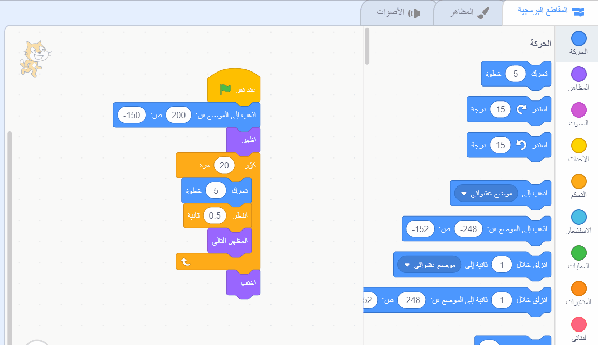

## التأخر عن الحافلة

<div style="display: flex; flex-wrap: wrap">
<div style="flex-basis: 200px; flex-grow: 1; margin-right: 15px;">
ماذا لو لم يعمل كائن القط بالسرعة الكافية للحاق بالحافلة؟
</div>
<div>

! [فقدت القطة الحافلة.] (images / cat-misses-bus.png) {: width = "300px"}

</div>
</div>

--- task ---

حدد **كائن القط** وأضف كتلة انتظار ``{: class = "block3control"}:


```blocks3
when flag clicked
go to x:(200) y:(-150) 
show
repeat (20) // try different numbers
move (5) steps 
next costume 
+ wait (1) seconds
end
hide
```
--- /task ---

--- task ---

**اختبار:** انقر فوق العلم الأخضر. سوف يمشي القط ببطء شديد ويفوت الحافلة!

--- /task ---

سوف تحتاج إلى تأخير أقل من ثانية واحدة. 0.5 نصف ثانية ، و 0.25 ربع ثانية ، و 0.1 جزء من الثانية.

--- task ---

تغيير التأخير في `الانتظار`{:class="block3control"} block:


```blocks3
wait (0.2) seconds // try 0.1, 0.5, 0.05
```

**اختبار:** انقر فوق العلم الأخضر ، وسيمشي كائن القط بشكل أسرع. اختر التأخير الذي تفضله.

--- /task ---

**اختر:** اختر ما إذا كنت تريد أن يفوتك **** أو **اللحاق بالحافلة**.

--- task ---

إذا كنت تريد أن يفوت كائن القط ** الحافلة ** ، فقم بإزالة كتلة ` إخفاء ` {: class = "block3looks"} من التعليمات البرمجية الخاصة بك حتى يظل الكائن في المنصة:




```blocks3
when flag clicked
go to x:(200) y:(-150) 
show
repeat (20) 
move (5) steps 
next costume
wait (0.5) seconds 
end
-hide
```
--- /task ---

--- task ---

إذا كنت تريد أن يستقل كائن القط **الحافلة ** ، فاجعل الحافلة تنتظر وقتًا أطول قبل مغادرتها:


```blocks3
+when [timer v] > [6] // change from 4 to 6
glide [2] secs to x: [320] y: [-100] // right-hand side of the Stage
hide
```

سوف تحتاج إلى `إخفاء`{: class = "block3looks"} مرة أخرى في رمز **Scratch Cat** sprite إذا كنت قد قمت بإزالتها وتريد أن تستقل القطة الحافلة بنجاح.

--- /task ---

--- task ---

قم بإجراء التغييرات حتى تحصل على الرسوم المتحركة تعمل بالطريقة التي تريدها.

--- /task ---

<p style="border-left: solid; border-width:10px; border-color: #0faeb0; background-color: aliceblue; padding: 10px;">
عند العمل في مشروع ما ، غالبًا ما تعود وتغير أو تُحسِّن التعليمات البرمجية عندما تحصل على أفكار جديدة. 
</p>

--- save ---


