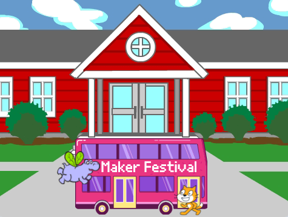

## قم بتغيير الوجهة

تقول الكتابة على الحافلة "Scratch Tours" ، ولكن يمكنك تغيير الوجهة إلى وجهة من اختيارك. أين تريد أن تذهب حافلتك؟  

{:width="300px"}

--- task ---

حدد **باص المدينة** وانقر فوق علامة التبويب **الازياء**:

--- /task ---

--- task ---

انقر على النص الأبيض "Scratch Tours" لتحديده ، ثم انقر على **حذف** لإزالته.

--- /task ---

**نصيحة:** يمكنك استخدام **حذف** في محرر الرسام أو <kbd>حذف</kbd> على لوحة المفاتيح.

--- task ---

حدد أداة **نص** (كتابة).

انقر على الحافلة حيث تريد أن يبدأ النص الخاص بك ، واكتب الوجهة التي تختارها.

لتغيير الخط (نمط الكتابة) ، يمكنك النقر فوق القائمة المنسدلة **الخط**:

--- /task ---

--- task ---

انقر فوق أداة **تحديد** (Arrow) ، ثم اسحب النص لوضعه في الحافلة.

--- /task ---

--- save ---
