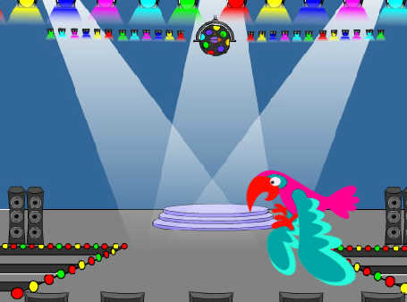

## I ara què ve?

If you are following the [Introduction to Scratch](https://projects.raspberrypi.org/en/pathways/scratch-intro){:target="_blank"} pathway, you can move on to the [Find the bug](https://projects.raspberrypi.org/en/projects/find-the-bug){:target="_blank"} project. En aquest projecte, fareu un joc en el qual haureu de trobar l'error que s'amaga a cada nivell.

--- print-only ---

--- /print-only ---

--- no-print ---

  <iframe allowtransparency="true" width="485" height="402" src="https://scratch.mit.edu/projects/embed/1156707423/?autostart=false" frameborder="0"></iframe>

--- /no-print ---

Si voleu divertir-vos més explorant Scratch, podeu provar qualsevol [d'aquests projectes](https://projects.raspberrypi.org/ca-ES/projects?software%5B%5D=scratch&curriculum%5B%5D=%201).
