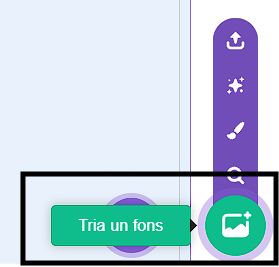
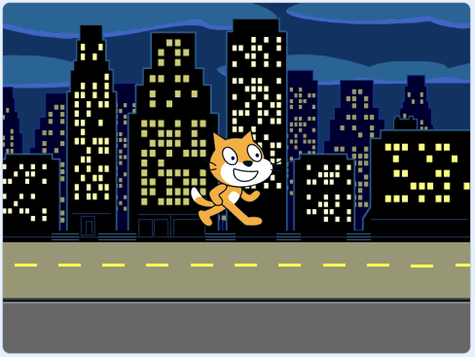
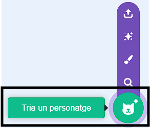
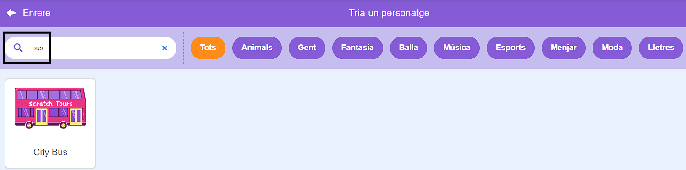
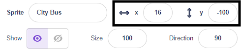
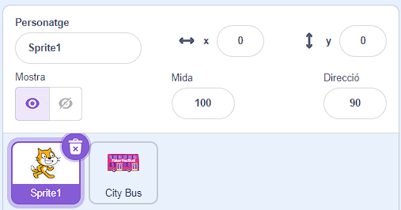
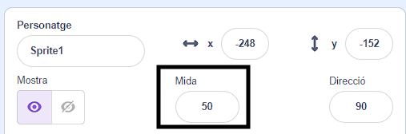

## Crea la teva escena d'autobús

<div style="display: flex; flex-wrap: wrap">
<div style="flex-basis: 200px; flex-grow: 1; margin-right: 15px;">
Tria un teló de fons i afegeix un personatge d'autobús.
</div>
<div>

{:width="300px"}

</div>
</div>

### Obre el projecte inicial

--- task ---

Obre el [projecte inicial Agafa l'autobús](https://scratch.mit.edu/projects/582214330/editor){:target="_blank"}. Scratch s'obrirà en una altra pestanya del navegador.

[[[working-offline]]]

--- /task ---

### Tria un teló de fons

--- task ---

Fes clic (o en una tauleta, toqueu) a **Tria un teló fons** al panell de l'escenari (a l'extrem inferior dret de la pantalla):



--- /task ---

--- task ---

Fes clic a la categoria **Exteriors**. Afegeix un teló de fons que sigui un bon punt de partida per al teu autobús:



--- /task ---

### Tria un personatge

--- task ---

Fes clic a **Tria un Personatge**:



--- /task ---

--- task ---

Escriu `bus` al quadre de cerca de la part superior:



Afegeix el personatge **City Bus** al vostre projecte.

--- /task ---

### Dona al vostre autobús una posició inicial

--- task ---

Assegurat que el personatge del  **City Bus** estigui seleccionat a la llista de Personatges a sota de l'escenari.

Arrossega un bloc `quan la bandera verda es cliqui`{:class="block3events"} des del menú de blocs `Esdeveniments`{:class="block3events"} a l'Àrea del codi:


```blocks3
when flag clicked
```

--- /task ---

--- task ---

Arrossega l'autobús fins a una bona posició a l'escenari:


Les coordenades **x** i **y** (els números utilitzats per descriure la posició) de l'autobús es mostren al panell de personatge a sota de l'escenari:



--- /task ---

--- task ---

Afegeix un `ves a x: y:`{:class="block3motion"} bloc:


```blocks3
when flag clicked
+go to x: (0) y: (-100)
```

Els números del bloc `ves a x: y:`{:class="block3motion"} són les coordenades x i y actuals de l'autobús. Els números del vostre projecte poden ser una mica diferents.

--- /task ---

--- task ---

**Prova:** Arrossegueu l'autobús fins a qualsevol lloc de l'escenari i, a continuació, feu clic a la bandera verda. L'autobús ha d'anar sempre a la seva posició inicial.


--- /task ---

### Mou l'autobús darrere dels gràfics dels personatges

--- task ---

Per assegurar-te que el personatge **City Bus** estigui sempre darrere de tots els altres personatges, afegeix un bloc `ves a la capa frontal`{:class="block3looks"} , feu clic a `front`{:class="block3looks"} i canvieu-lo a `darrere`{:class="block3looks"}:


```blocks3
when flag clicked
go to x: (0) y: (-100)
+ go to [back v] layer
```

**Consell:** Si no pots veure el bloc `ves a la capa`{:class="block3looks"}, has d'anar baixant dintre del menú de bloc  `Aspecte`{:class="block3looks"}.

--- /task ---

### Canvia el color de l'autobús

--- task ---

Pots canviar el color de l'autobús:


```blocks3
when flag clicked
go to x: (0) y: (-100)
go to [back v] layer
+set [color v] effect to (50) // try numbers up to 200
```

--- /task ---

### Canvia la mida del gat Scratch

--- task ---

El gat Scratch apareix en tots els projectes nous de Scratch com a **Sprite1** a la llista de Personatges. Fes clic al personatge **Sprite1** a la llista de Personatges per preparar-vos per animar al gat Scratch:



**Consell:** Si per accident esborrés el personatge **Sprite1** gat Scratch, pots fer clic a la icona de **Tria un personatge** i cercar per `cat`.

--- /task ---

--- task ---

Al panell de personatge, feu clic a la propietat **Mida** i canvieu la mida del gat Scratch a `50`:



--- /task --- 
