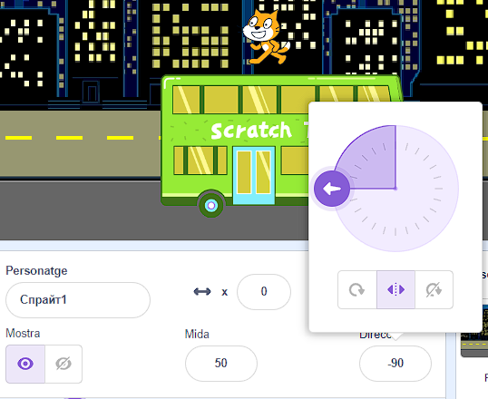
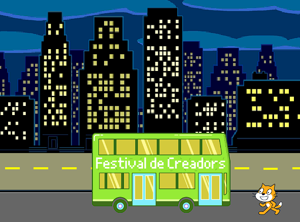
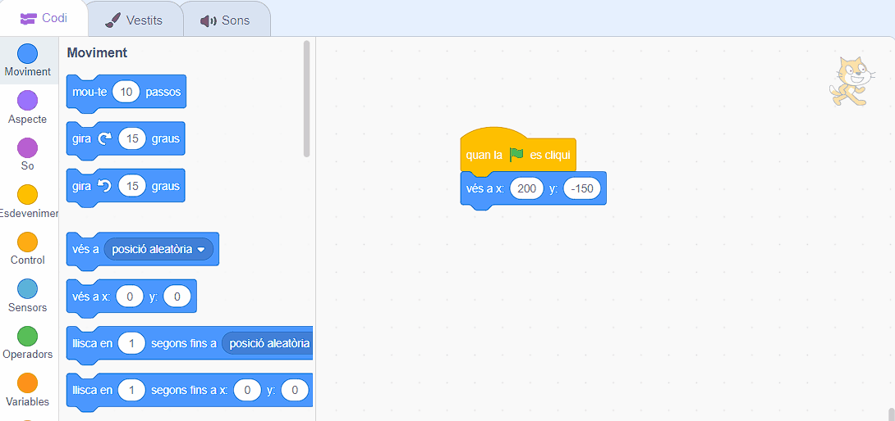

## El gat Scratch agafa l'autobús

<div style="display: flex; flex-wrap: wrap">
<div style="flex-basis: 200px; flex-grow: 1; margin-right: 15px;">
Anima al gat  Scratch perquè aparegui al **costat dret** de l'escenari i camini fins a l'autobús repetint un petit moviment moltes vegades en un **bucle**. 
</div>
<div>

{:width="300px"}

</div>
</div>

### Posa el gat Scratch a la seva posició inicial

--- task ---

Fes clic a la propietat **Direcció** a la subfinestra Sprite. Gira la fletxa fins a `-90`. A continuació, fes clic a la icona **Esquerra/Dreta** al mig per canviar l'estil de rotació a `esquerra-dreta` per evitar que el gat Scratch es giri cap per avall:



--- /task ---

--- task ---

Arrossega el gat Scratch a la part inferior dreta de l'escenari.



**Consell:** Si intentes situar un personatge fora de l'escenari, tornarà a la seva darrera posició a l'escenari.

--- /task ---

--- task ---

Afegeix el codi per fer que el gat Scratch vagi a la  seva posició inicial:


```blocks3
when flag clicked
go to x:(200) y:(-150) // bottom right-hand side
```

--- /task ---

--- task ---

**Prova:** Arrossega al gat Scratch a una posició nova i, a continuació, feu clic al bloc `ves a x: y:`{:class="block3motion"} . El gat s'ha de moure cap a la part inferior dreta cada vegada.

--- /task ---

### Anima el gat Scratch

Afegiràs el codi en un bucle `repeteix`{:class="block3control"} per fer que gat Scratch repeteixi un petit nombre de passos moltes vegades. Això farà que el gat Scratch aparegui animat.

--- task ---

Afegeix un bloc `repetix`{:class="block3control"} `10` i arrossega un bloc `mou-te`{: class="block3motion"} `10` `passos`{:class="block3motion"} dins d'ell:




```blocks3
when flag clicked
go to x:(200) y:(-150) // bottom right-hand side
+ repeat (10) // try different numbers
move (5) steps //  5 is a good walking speed
end
```

--- /task ---

--- task ---

**Prova:** Feu clic a la bandera verda. Prova de canviar els números al bloc `repeteix`{:class="block3control"} `10` perquè el gat Scratch s'aturi a l'autobús.

--- /task ---

Alguns personatges tenen més d'un gràfic. Fes servir els gràfics de personatge **Scratch Cat** per crear una animació del gat Scratch caminant.

--- task ---

Fes clic a la pestanya **Vestits** . El personatge **Scratch Cat** té dos gràfics, i junts es poden utilitzar per fer un moviment caminant.

--- /task ---

--- task ---

Fes clic a la pestanya **Codi** . Afegiu un bloc de `següent vestit`{:class="block3looks"} dins del bloc `repeteix`{:class="block3control"}:


```blocks3
when flag clicked
go to x:(200) y:(-150) // bottom right-hand side
repeat (20) // try different numbers
move (5) steps //  5 is a good walking speed
+ next costume 
end
```
--- /task ---

--- task ---

**Prova:** Feu clic a la bandera verda i el gat Scratch anirà a l'autobús.

--- /task ---

### Amaga el gat Scratch

--- task ---

Afegeix un bloc al gat Scratch `amaga't`{:class="block3looks"} quan arribin a l'autobús:


```blocks3
when flag clicked
go to x:(200) y:(-150) // bottom right-hand side
repeat (20) // try different numbers
move (5) steps //  5 is a good walking speed
next costume 
end
+ hide
```

--- /task ---

--- task ---

**Prova:** Feu clic de nou a la bandera verda i veureu que el gat Scratch ara ha desaparegut.

--- /task ---

### Mostra el gat Scratch

--- task ---

Afegeix un bloc `mostra't`{:class="block3looks"} perquè aparegui el gat Scratch abans de caminar cap a l'autobús:


```blocks3
when flag clicked
go to x:(200) y:(-150) // bottom right-hand side
+ show
repeat (20) // try different numbers
move (5) steps //  5 is a good walking speed
next costume 
end
hide
```

**Consell:** Quan fas ús un bloc `amaga't`{:class="block3looks"}, has d'afegir un bloc `mostra't`{:class="block3looks"} per assegurar-se de què el personatge és visible quan ho ha de ser.

--- /task ---

--- task ---

**Prova:** Feu clic a la bandera verda per provar el vostre projecte i assegureu-vos que apareix el gat Scratch.

--- /task ---

