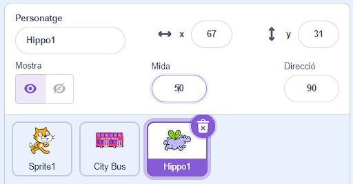

## L'hipopòtam corre cap a l'autobús

<div style="display: flex; flex-wrap: wrap">
<div style="flex-basis: 200px; flex-grow: 1; margin-right: 15px;">
Afegeix un hipopòtam que corre cap a l'autobús.
</div>
<div>

{:width="300px"}

</div>
</div>

### Dona a l'hipopòtam una posició inicial

--- task ---

Afegeix el personatge **Hippo1** al vostre projecte.

Canvia la **Mida** del **Hippo1** :



--- /task ---

--- task ---

Arrossega l'hipopòtam a la part superior esquerra de l'escenari.


--- /task ---

--- task ---

Afegeix el codi per portar l'hipopòtam a la seva posició inicial:

```blocks3
when flag clicked
go to x: [-200] y: [150] // top left-hand side
```

**Consell:** Les coordinades `x`{:class="block3motion"} i `y`{:class="block3motion"} en el bloc `ves a x: y:`{:class="block3motion"} serà la posició actual de l'hipopòtam, de manera que no cal que les introduïu.

--- /task ---

### Fes que l'hipopòtam bati les ales i voli

--- task ---

Afegeix el codi per fer que l'hipopòtam voli cap al **City Bus**:

```blocks3
when flag clicked
go to x: [-200] y: [150] 
+repeat [100] 
point towards (City Bus v) // change from mouse-pointer
move [3] steps
next costume
+end
```

--- /task ---

--- task ---

**Prova:** Fes clic a la bandera verda i el gat Scratch anirà a l'autobús. Pots canviar el número al bloc `repeteix`{:class="block3control"} per aconseguir que l'hipopòtam s'aturi al lloc correcte.

--- /task ---

### Mostra i amaga l'autobús

--- task ---

Afegeix blocs `mostra't`{:class="block3looks"} i `amaga't`{:class="block3looks"}:

```blocks3
when flag clicked
go to x: [-200] y: [150] 
+ show
repeat [90] 
point towards (City Bus v)
move [3] steps
next costume
end
+ hide
```

--- /task ---

--- task ---

**Prova:** Feu clic a la bandera verda. L'hipopòtam volarà i entrarà a l'autobús.

--- /task ---
