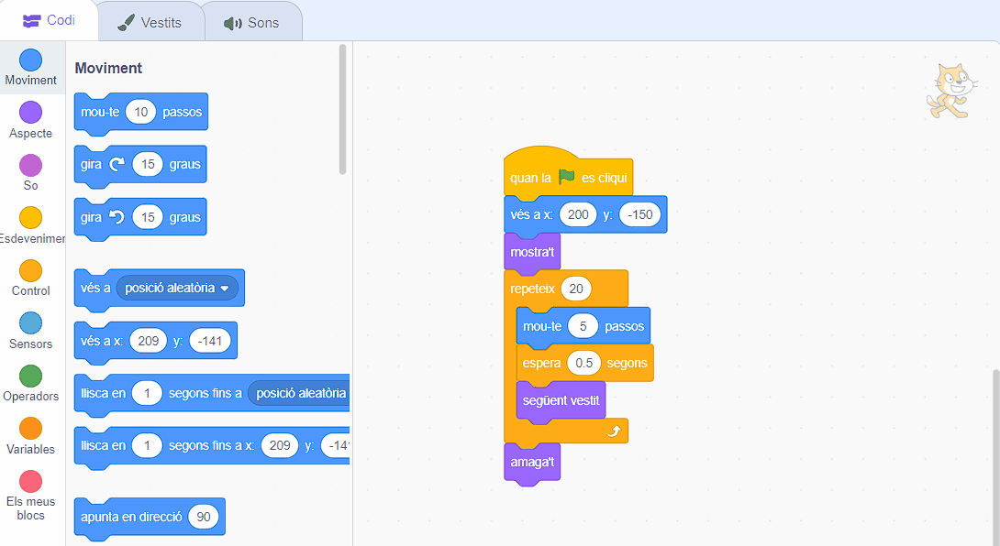

## Falta l'autobús

<div style="display: flex; flex-wrap: wrap">
<div style="flex-basis: 200px; flex-grow: 1; margin-right: 15px;">
Què passa si el gat Scratch no corre prou de pressa per agafar l'autobús?
</div>
<div>

{:width="300px"}

</div>
</div>

### Fes que el gat Scratch perdi l'autobús

--- task ---

Selecciona el personatge  **Scratch Cat** i afegeix un bloc `esperar`{:class="block3control"}:


```blocks3
when flag clicked
go to x:(200) y:(-150) 
show
repeat (20) // try different numbers
move (5) steps 
next costume 
+ wait (1) seconds
end
hide
```
--- /task ---

--- task ---

**Prova:** Fes clic a la bandera verda. El gat Scratch caminarà massa lent i perdrà l'autobús!

--- /task ---

### Fes que el gat Scratch perdi l'autobús

--- task ---

Vols retards de menys d'un segon. 0,5 és mig segon, 0,25 és un quart de segon i 0,1 és una dècima de segon.

Canvia el retard al bloc `esperar`{:class="block3control"}:


```blocks3
wait (0.2) seconds // try 0.1, 0.5, 0.05
```

**Prova:** Feu clic a la bandera verda i el gat Scratch caminarà més ràpid. Tria el retard que més us agradi.

--- /task ---

### Tria si el gat Scratch agafa o perd l'autobús

--- task ---

Si vols que el gat Scratch **perdi l'autobús**, elimina el bloc `amaga't`{:class="block3looks"} del teu codi perquè el gat es quedi a l'escenari:




```blocks3
when flag clicked
go to x:(200) y:(-150) 
show
repeat (20) 
move (5) steps 
next costume
wait (0.5) seconds 
end
-hide
```
--- /task ---

--- task ---

Si vols que el gat Scratch **agafi l'autobús**, feu que l'autobús s'esperi més temps abans de sortir:


```blocks3
when flag clicked 
+wait [4] seconds // change from 4 to 6
glide [2] secs to x: [320] y: [-100] // right-hand side of the Stage
hide
```

Hauràs de tornar a posar el bloc `amaga't`{:class="block3looks"} al codi del personatge **gat Scratch** si l'has eliminat i vols que el gat Scratch agafi l'autobús a temps.

--- /task ---

--- task ---

Fes canvis fins que l'animació funcioni com vols.

--- /task ---

<p style="border-left: solid; border-width:10px; border-color: #0faeb0; background-color: aliceblue; padding: 10px;">
Quan treballes en un projecte, pots tornar enrere i canviar o millorar el teu codi a mesura que tinguis noves idees. 
</p>


