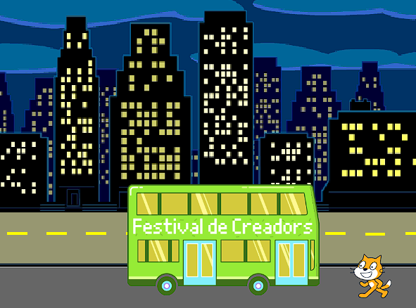
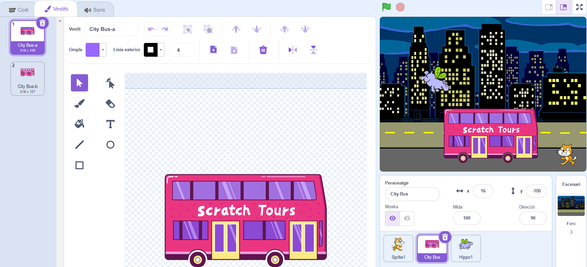
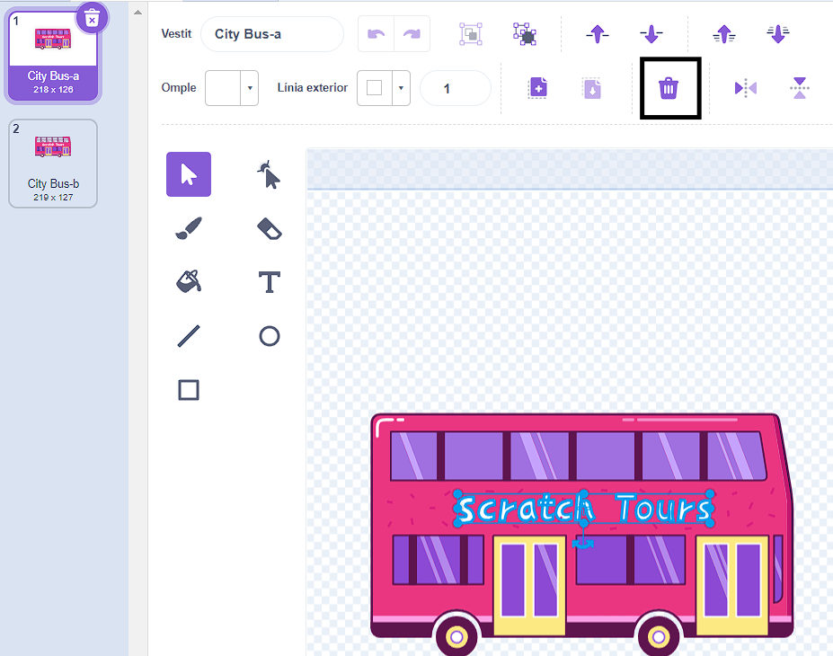
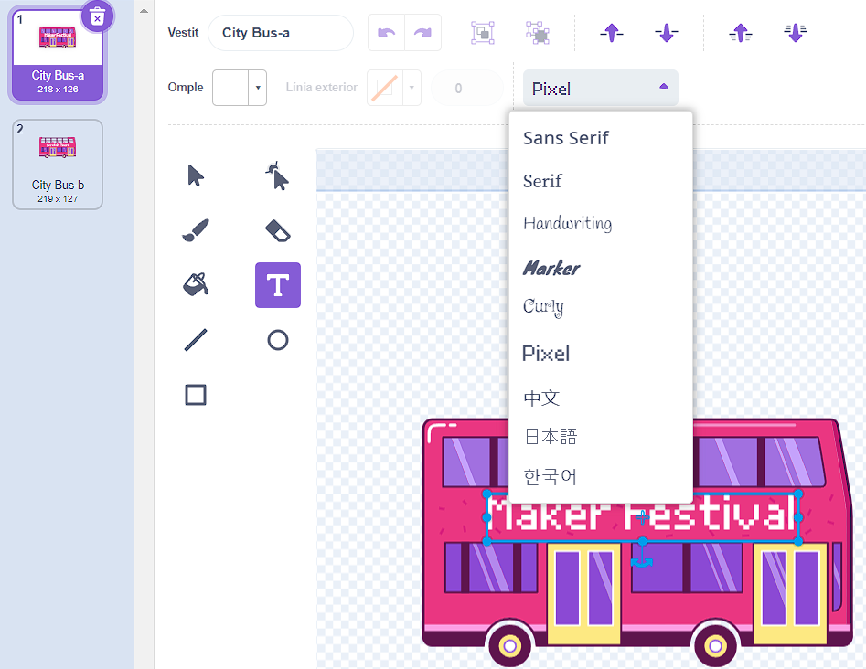
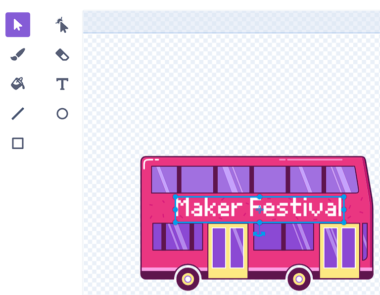

## Canvia la destinació

Les lletres de l'autobús diu "Scratch Tours", però podeu canviar la destinació per una de la vostra elecció. On vols que vagi el teu autobús?  

{:width="300px"}

### Edita el personatge del 'City Bus'

--- task ---

Selecciona el personatge **City Bus** i feu clic a la pestanya **Vestits** :

--- /task ---

--- task ---

Fes clic al text blanc "Scratch Tours" per seleccionar-lo i, a continuació, fes clic a **Esborrar** per eliminar-lo.

**Consell:** Pots utilitzar la icona **Esborrar** a l'editor gràfic o la tecla <kbd>Suprimir</kbd> del teclat.

--- /task ---

--- task ---

Selecciona l'eina **Text** (escriptura).

Fes clic a l'autobús on voleu que comenci el text i escriviu la destinació que trieu.

Per canviar l'estil d'escriptura, pots fer clic al menú desplegable **Font** :

--- /task ---

--- task ---

Fes clic a l'eina **Seleccioneu** (fletxa) i arrossega el text per col·locar-lo a l'autobús.

--- /task ---

