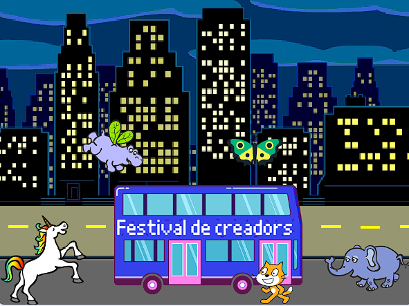

## Actualitza el teu projecte

Ara, pots afegir un personatge de la vostra elecció a la vostra animació. Et caldrà afegir codi al teu personatge a `ves a`{:class="block3motion"} a starting position, `punt`{:class="block3motion"} en la direcció correcte, y llavors `repeteix`{:class="block3control"} `mou-te`{:class="block3motion"} i `següent vestit`{:class="block3looks"} per arribar al autobús.

**Consell:** Quan facis clic a **Trieu un Personatge**, pots mantenir el cursor del ratolí sobre un personatge per veure'n els vestits, o en alguns dispositius mòbils, podeu tocar i mantenir premut un personatge per veure els seus vestits (si apareix una finestra quan toqueu i manteniu premut un personatge, toqueu al costat de la pantalla per tancar la finestra i veure els vestits). Mirar els vestits dels personatges et pot ajudar a trobar un personatge que funcioni bé per a l'animació.

{:width="300px"}

Pots utilitzar qualsevol dels blocs que heu après en aquest projecte, així com els que ja coneixeu:

```blocks3
when flag clicked

go to x: [0] y: [0] // drag the sprite to choose x and y

show

hide

glide [2] secs to x: [0] y: [-100] // bottom middle of the Stage

repeat [30]
end

point towards (City Bus v)

point in direction (180) // point down

set rotation style [left-right v]

move [3] steps

next costume

start sound [clown honk v]

wait [0.1] seconds // short delay

set [color v] effect to [50] // up to 200
```

--- collapse ---
---
títol: Projecte finalitzat
---

Pots veure el [projecte completat  aquí](https://scratch.mit.edu/projects/724160134/){:target="_blank"}.

--- /collapse ---

També pots "reinventar" el projecte per fer els canvis que vulgueu. Pots afegir efectes de so a l'autobús o altres personatges, o definir l'efecte de color de l'autobús. Un dels personatges podria perdre l'autobús i no amagar-se.

Gràcies al constructora digital Lyla per enviar aquesta fantàstica actualització!


--- save ---
