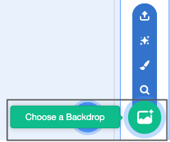
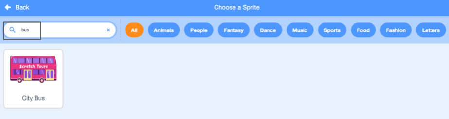

## Vytvoř svou autobusovou scénu

<div style="display: flex; flex-wrap: wrap">
<div style="flex-basis: 200px; flex-grow: 1; margin-right: 15px;">
Vyber si pozadí a přidej autobusového skřítka.
</div>
<div>

{:width="300px"}

</div>
</div>

### Otevři úvodní projekt

--- task ---

Otevři [startovací projekt výzvy Stihni autobus](https://scratch.mit.edu/projects/582214330/editor){:target="_blank"}. Scratch se otevře na jiné kartě prohlížeče.

[[[working-offline]]]

--- /task ---

### Vybrat pozadí

--- task ---

Klikni (nebo na tabletu klepni) na **Vyber pozadí** v podokně Scéna (v pravém dolním rohu obrazovky):



--- /task ---

--- task ---

Klikněte na kategorii **Venkovní**. Přidej pozadí, které bude dobrým startovacím bodem pro tvůj autobus:


--- /task ---

### Vyber skřítka

--- task ---

Klikni na **Vyber skřítka**:


--- /task ---

--- task ---

Do vyhledávacího pole nahoře zadej `autobus`:



Přidej skřítka **City Bus** do svého projektu.

--- /task ---

### Vyber svému autobusu výchozí pozici

--- task ---

Ujisti se, že je v seznamu Skřítek pod scénou vybrán skřítek **městského autobusu**.

Přetáhni blok `po kliknutí na zelenou vlajku`{:class="block3events"} z menu bloků `Události`{:class="block3events"} do oblasti Kód:


```blocks3
when flag clicked
```

--- /task ---

--- task ---

Přetáhni autobus na správnou pozici na scéně:


Souřadnice **x** a **y** (čísla použitá k popisu polohy) autobusu jsou zobrazeny v podokně Skřítek pod vymezenou plochou:


--- /task ---

--- task ---

Přidej blok `jdi na x: y:`{:class="block3motion"}:


```blocks3
when flag clicked
+go to x: (0) y: (-100)
```

Čísla v bloku `jdi na x: y:`{:class="block3motion"} jsou aktuální souřadnice x a y autobusu. Čísla ve tvém projektu mohou být trochu jiná.

--- /task ---

--- task ---

**Test:** Přetáhni autobus kamkoli na scénu a poté klikni na zelenou vlajku. The bus should always go to its starting position.


--- /task ---

### Move the bus behind the character sprites

--- task ---

To make sure that the **City Bus** sprite is always behind all the character sprites, add a `go to front layer`{:class="block3looks"} block, then click on `front`{:class="block3looks"} and change it to `back`{:class="block3looks"}:


```blocks3
when flag clicked
go to x: (0) y: (-100)
+ go to [back v] layer
```

**Tip:** If you cannot see the `go to front layer`{:class="block3looks"} block, you need to scroll down in the `Looks`{:class="block3looks"} blocks menu.

--- /task ---

### Change the bus colour

--- task ---

You can change the colour of the bus:


```blocks3
when flag clicked
go to x: (0) y: (-100)
go to [back v] layer
+set [color v] effect to (50) // try numbers up to 200
```

--- /task ---

### Resize the Scratch Cat

--- task ---

The Scratch Cat appears in all new Scratch projects as **Sprite1** in the Sprite list. Click on the **Sprite1** sprite in the Sprite list to get ready to animate the Scratch Cat:


**Tip:** If you have accidentally deleted the **Sprite1** (Scratch Cat) sprite, you can click on the **Choose a Sprite** icon and search for `cat`.

--- /task ---

--- task ---

In the Sprite pane, click in the **Size** property and change the Scratch Cat's size to `50`:


--- /task --- 
