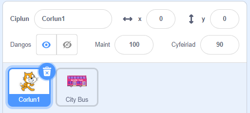

## Creu dy olygfa bws

<div style="display: flex; flex-wrap: wrap">
<div style="flex-basis: 200px; flex-grow: 1; margin-right: 15px;">
Byddi di'n dewis cefnlen ac yn ychwanegu corlun bws.
</div>
<div>

{:width="300px"}

</div>
</div>

--- task ---

Agora'r [prosiect cychwynnol dal y bws](https://scratch.mit.edu/projects/582214330/editor){:target="_blank"}. Bydd Scratch yn agor mewn tab arall ar y porwr.

[[[working-offline]]]

--- /task ---

--- task ---

Clicia (neu daro os wyt ti ar dabled) ar **Dewiswch Gefnlen** yn y cwarel Llwyfan (yng nghornel dde isaf y sgrin):


--- /task ---

--- task ---

Clicia'r categori **Tu allan**. Ychwanega gefndir a fyddai'n fan cychwyn da ar gyfer dy fws:


--- /task ---

--- task ---

Clicia ar **Dewiswch Gorlun**:


--- /task ---

--- task ---

Teipia `bus` yn y blwch chwilio ar y brig:


Ychwanega'r corlun **City Bus** at dy brosiect.

--- /task ---

 Yn Scratch, rwyt ti'n rhedeg prosiectau drwy glicio ar y faner werdd uwchben y Llwyfan. Mae angen i'r bws fod yn ei safle cychwynnol `ar ôl clicio'r faner werdd`{: class = "block3events"}.

--- task ---

Gwna'n siŵr dy fod wedi dewis y corlun **City Bus** yn y rhestr o Gorluniau o dan y Llwyfan.

Llusga floc `pan fydd y faner werdd wedi'i chlicio`{: class = "block3events"} o'r ddewislen blociau `Digwyddiadau`{: class = "block3events"} i ardal y Cod:


```blocks3
when flag clicked
```

--- /task ---

--- task ---

Llusga'r bws i safle da ar y Llwyfan:


Mae cyfesurynnau **x** ac **y** (sef y rhifau a ddefnyddir i ddisgrifio'r safle) y bws yn cael eu dangos yng nghwarel y Corlun o dan y Llwyfan:


--- /task ---

--- task ---

Ychwanega floc `mynd i x: y:`{:class="block3motion"}:


```blocks3
when flag clicked
+go to x: (0) y: (-100)
```

Y rhifau yn y bloc `mynd i x: y:` yw cyfesurynnau x ac y presennol y bws. Efallai bydd y rhifau yn dy brosiect di ychydig yn wahanol.

--- /task ---

--- task ---

**Prawf:** Llusga'r bws i unrhyw le ar y Llwyfan, ac yna clicia ar y faner werdd. Dylai'r bws fynd i'w fan cychwyn bob amser.

--- /task ---

Pan fyddi di'n llusgo'r bws, bydd yn mynd o flaen y Scratch Cat.

--- task ---

I wneud yn siŵr bod y corlun **City Bus** bob amser y tu ôl i gorluniau cymeriadau, ychwanega floc `mynd i haen blaen`{:class="block3looks"}, ac wedyn clicio `blaen`{:class="block3looks"} i'w newid i `cefn`{:class="block3looks"}:


```blocks3
when flag clicked
go to x: (0) y: (-100)
+ go to [back v] layer
```

**Awgrym:** Os nad wyt ti'n gallu gweld y bloc `mynd i haen blaen`{: class = "block3looks"}, mae angen i ti sgrolio i lawr yn y ddewislen blociau `Edrychiad`{: class = "block3looks"}.

--- /task ---

--- task ---

Galli di newid lliw y bws:


```blocks3
when flag clicked
go to x: (0) y: (-100)
go to [back v] layer
+set [color v] effect to (50) // try numbers up to 200
```

--- /task ---

--- task ---

Mae'r Gath Scratch yn ymddangos ym mhob prosiect Scratch newydd fel **Sprite1** yn rhestr Corluniau. Clicia ar y corlun **Sprite1** yn y rhestr Corluniau i baratoi i animeiddio'r Scratch Cat:



**Awgrym:** Os wyt ti wedi dileu'r corlun **Sprite1** (Scratch Cat) yn ddamweiniol, galli di glicio ar yr eicon **Dewiswch Gorlun** a chwilio am `cat`.

--- /task ---

Ar hyn o bryd, mae'r Gath Scratch yn rhy fawr i ffitio ar y bws.

--- task ---

Yn y cwarel Corluniau, cliciwch yn y briodwedd **Maint** a newid maint y Gath Scratch i `50`:


--- /task ---

--- save ---
