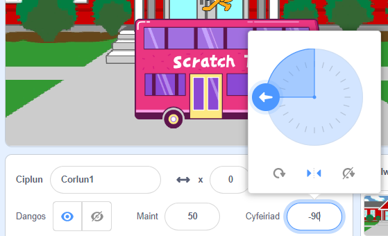
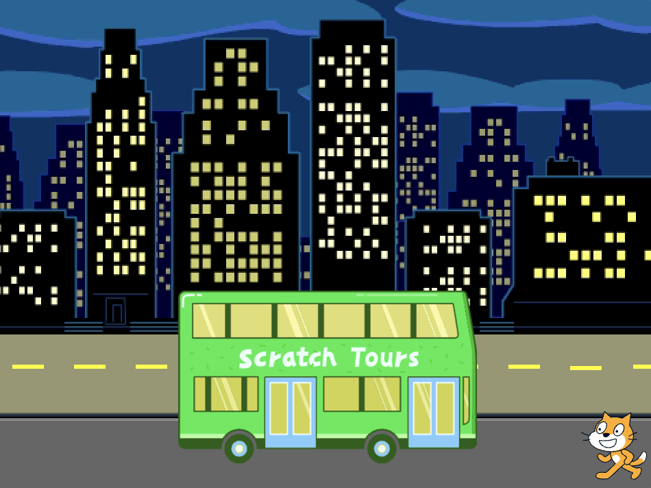
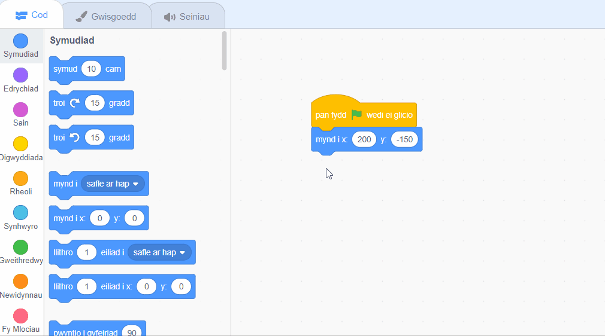

## Y Gath Scratch yn dal y bws

<div style="display: flex; flex-wrap: wrap">
<div style="flex-basis: 200px; flex-grow: 1; margin-right: 15px;">
Byddi di'n animeiddio'r Gath Scratch i ymddangos ar **ochr dde** y Llwyfan a cherdded i'r bws trwy ailadrodd symudiad bach sawl gwaith mewn **dolen**. 
</div>
<div>

{:width="300px"}

</div>
</div>

### Rhoi'r Gath Scratch yn ei safle dechreuol

--- task ---

Clicia'r briodwedd **Cyfeiriad** yn y cwarel Corluniau. Tro'r saeth i bwyntio i `-90`. Wedyn, clicia'r eicon **Chwith/Dde** yn y canol i newid yr arddull cylchdroi i `chwith-dde` er mwyn atal y Gath Scratch rhag troi wyneb i waered:



--- /task ---

--- task ---

Llusga'r Gath Scratch i ochr dde y Llwyfan.



**Tip:** If you try to position a sprite off the Stage, it will move back to its last position on the Stage.

--- /task ---

--- task ---

Add code to get the Scratch Cat to their starting position:


```blocks3
when flag clicked
go to x:(200) y:(-150) // bottom right-hand side
```

--- /task ---

--- task ---

**Test:** Drag the Scratch Cat to a new position, then click on your `go to x: y:`{:class="block3motion"} block. The Scratch Cat should move back to the bottom right-hand side each time.

--- /task ---

### Animeiddio'r Gath Scratch

You will add code in a `repeat`{:class="block3control"} loop to make the Scratch Cat repeat a small number of steps many times. This will make the Scratch Cat appear animated.

--- task ---

Add a `repeat`{:class="block3control"} `10` block, then drag a `move`{:class="block3motion"} `10` `steps`{:class="block3motion"} block inside it:




```blocks3
when flag clicked
go to x:(200) y:(-150) // bottom right-hand side
+ repeat (10) // try different numbers
move (5) steps //  5 is a good walking speed
end
```

--- /task ---

--- task ---

**Test:** Click on the green flag. Try changing the numbers in the `repeat`{:class="block3control"} `10` block so that the Scratch Cat stops at the bus.

--- /task ---

Some sprites have more than one costume. You will use the **Scratch Cat** sprite's costumes to create an animation of the Scratch Cat walking.

--- task ---

Click on the **Costumes** tab. The **Scratch Cat** sprite has two costumes, and together, they can be used to make a walking movement.

--- /task ---

--- task ---

Click on the **Code** tab. Add a `next costume`{:class="block3looks"} block inside the `repeat`{:class="block3control"} block:


```blocks3
when flag clicked
go to x:(200) y:(-150) // bottom right-hand side
repeat (20) // try different numbers
move (5) steps //  5 is a good walking speed
+ next costume 
end
```
--- /task ---

--- task ---

**Test:** Click on the green flag, and the Scratch Cat will walk to the bus.

--- /task ---

### Hide the Scratch Cat

--- task ---

Ychwanega floc i `guddio`{:class="block3looks"} y Gath Scratch pan fydd hi'n cyrraedd y bws:


```blocks3
when flag clicked
go to x:(200) y:(-150) // bottom right-hand side
repeat (20) // try different numbers
move (5) steps //  5 is a good walking speed
next costume 
end
+ hide
```

--- /task ---

--- task ---

**Prawf:** Clicia ar y faner werdd eto, ac fe weli di fod y Gath Scratch bellach wedi diflannu.

--- /task ---

### Show the Scratch Cat

--- task ---

Add a `show`{:class="block3looks"} block so that the Scratch Cat appears before they walk to the bus:


```blocks3
when flag clicked
go to x:(200) y:(-150) // bottom right-hand side
+ show
repeat (20) // try different numbers
move (5) steps //  5 is a good walking speed
next costume 
end
hide
```

**Tip:** When you use a `hide`{:class="block3looks"} block, you need to also add a `show`{:class="block3looks"} block to make sure that a sprite is visible when it needs to be.

--- /task ---

--- task ---

**Test:** Click on the green flag to test your project, and make sure that the Scratch Cat appears.

--- /task ---

