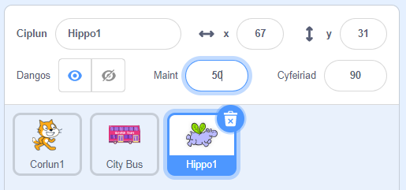

## Yr hipo yn hedfan i'r bws

<div style="display: flex; flex-wrap: wrap">
<div style="flex-basis: 200px; flex-grow: 1; margin-right: 15px;">
Byddi di'n ychwanegu corlun hipo sy'n hedfan i'r bws.
</div>
<div>

{:width="300px"}

</div>
</div>

Mae gan y corlun **Hippo1** ddwy wisg sydd ag adenydd mewn gwahanol safleoedd, fel bod modd animeiddio'r corlun i hedfan i'r bws.

--- task ---

Ychwanega'r corlun **City Bus** at dy brosiect.

Newidia **Faint** y corlun **Hippo1**:



--- /task ---

--- task ---

Llusga'r hipo i ochr chwith uchaf y Llwyfan.


--- /task ---

--- task ---

Ychwanega god i roi'r hipo yn ei safle dechreuol:

```blocks3
when flag clicked
go to x: [-200] y: [150] // top left-hand side
```

**Awgrym:** Bydd y cyfesurynnau `x`{:class="block3motion"} ac `y`{:class="block3motion"} yn y bloc `mynd i x: y:`{:class="block3motion"} yn adlewyrchu safle presennol yr hipo felly does dim rhaid i ti eu teipio.

--- /task ---

Bydd yr hipo yn hedfan tuag at y bws, gan fflapio ei adenydd.

Bydd yr hipo yn `pwyntio tuag at`{: class = "block3motion"} y bws cyn symud.

--- task ---

Ychwanega god i wneud i'r hipo hedfan tuag at **Bws y Ddinas**:

```blocks3
when flag clicked
go to x: [-200] y: [150] 
+repeat [100] 
point towards (City Bus v) // change from mouse-pointer
move [3] steps
next costume
+end
```

--- /task ---

--- task ---

**Prawf:** Clicia ar y faner werdd a gwirio bod yr hipo yn hedfan i'r bws. Galli di newid y rhif yn y bloc `ailadrodd`{:class="block3control"} i gael yr hipo i stopio yn yr union le cywir.

--- /task ---

Nawr, bydd yr hipo yn mynd i mewn i'r bws.

--- task ---

Ychwanega flociau `dangos`{:class="block3looks"} a `cuddio`{:class="block3looks"}:

```blocks3
when flag clicked
go to x: [-200] y: [150] 
+ show
repeat [90] 
point towards (City Bus v)
move [3] steps
next costume
end
+ hide
```

--- /task ---

--- task ---

**Prawf:** Clicia ar y faner werdd. Bydd yr hipo yn hedfan ac yn mynd i mewn i'r bws.

--- /task ---

--- save ---
