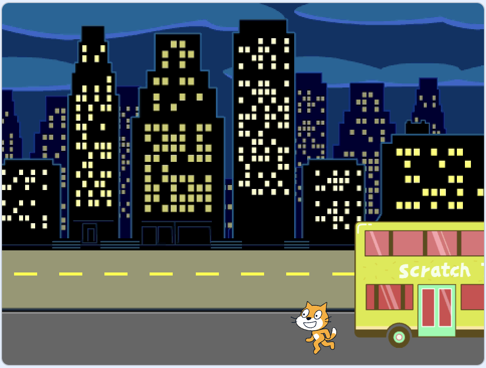
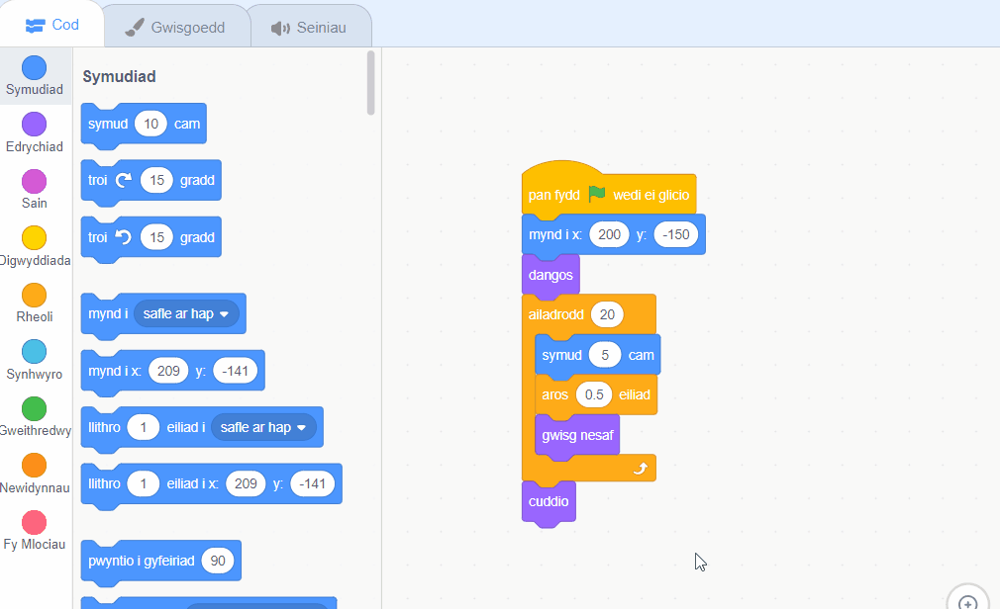

## Methu'r bws

<div style="display: flex; flex-wrap: wrap">
<div style="flex-basis: 200px; flex-grow: 1; margin-right: 15px;">
Beth os nad oedd y Gath Scratch wedi rhedeg yn ddigon cyflym i ddal y bws?
</div>
<div>

{:width="300px"}

</div>
</div>

### Make Scratch Cat miss the bus

--- task ---

Dewisa gorlun y **Gath Scratch** ac ychwanegu bloc `aros`{:class="block3control"}:


```blocks3
when flag clicked
go to x:(200) y:(-150) 
show
repeat (20) // try different numbers
move (5) steps 
next costume 
+ wait (1) seconds
end
hide
```
--- /task ---

--- task ---

**Prawf:** Clicia ar y faner werdd. Bydd y Gath Scratch yn cerdded yn rhy araf ac yn methu'r bws!

--- /task ---

### Make Scratch Cat catch the Bus

--- task ---

You will want delays of less than one second. 0.5 is half a second, 0.25 is a quarter of a second, and 0.1 is a tenth of a second.

Newidia yr amser oedi yn y bloc `aros`{:class="block3control"}:


```blocks3
wait (0.2) seconds // try 0.1, 0.5, 0.05
```

**Prawf:** Clicia ar y faner werdd, a bydd y Gath Scratch yn cerdded yn gyflymach. Dewisa'r amser oedi sydd well gen ti.

--- /task ---

### Choose if Scratch Cat catches or misses the bus

--- task ---

If you want the Scratch Cat to **miss the bus**, remove the `hide`{:class="block3looks"} block from your code so that the Scratch Cat stays on the Stage:




```blocks3
when flag clicked
go to x:(200) y:(-150) 
show
repeat (20) 
move (5) steps 
next costume
wait (0.5) seconds 
end
-hide
```
--- /task ---

--- task ---

If you want the Scratch Cat to **catch the bus**, make the bus wait longer before it leaves:


```blocks3
+when [timer v] > [6] // newid o 4 i 6
glide [2] secs to x: [320] y: [-100] // ochr dde'r Llwyfan
hide
```

You will need to put the `hide`{:class="block3looks"} block back in the **Scratch Cat** sprite's code if you have removed it and want the Scratch Cat to successfully catch the bus.

--- /task ---

--- task ---

Make changes until you get the animation to work the way that you want it to.

--- /task ---

<p style="border-left: solid; border-width:10px; border-color: #0faeb0; background-color: aliceblue; padding: 10px;">
When working on a project, you often go back and change or improve your code as you get new ideas. 
</p>


