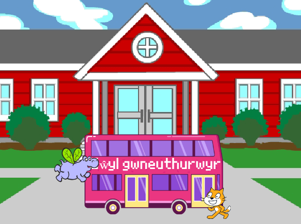
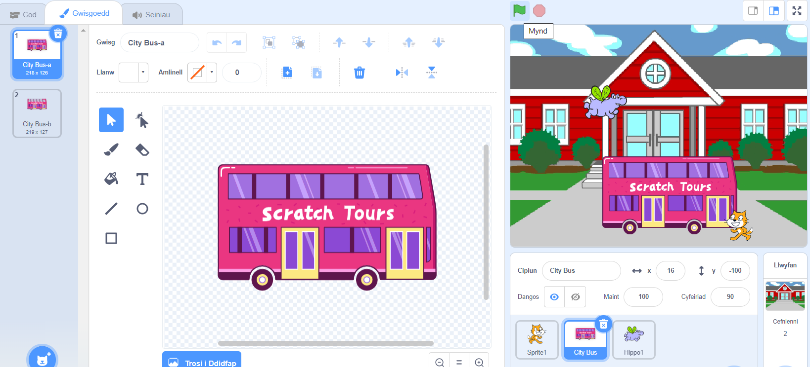
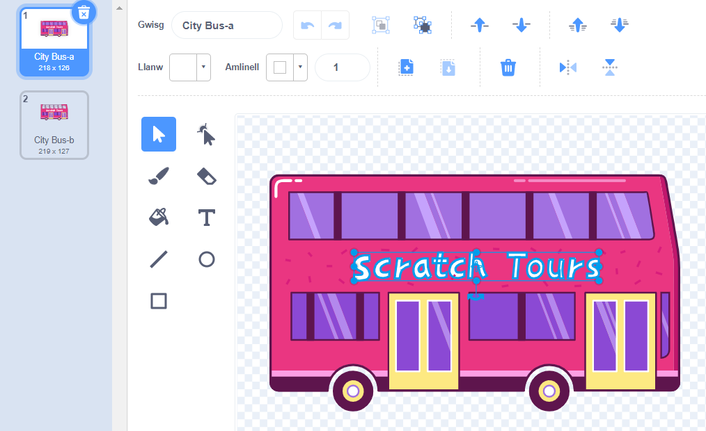
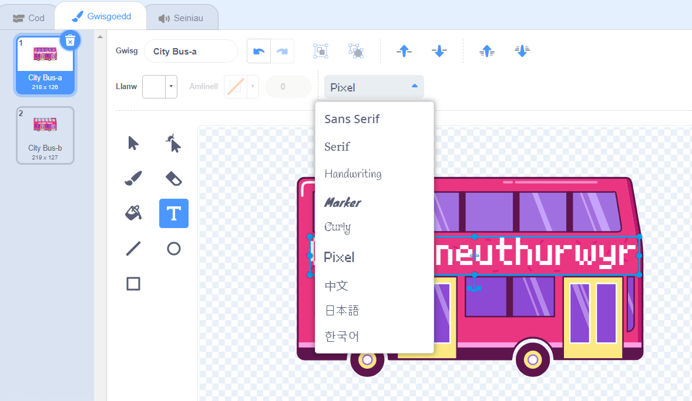
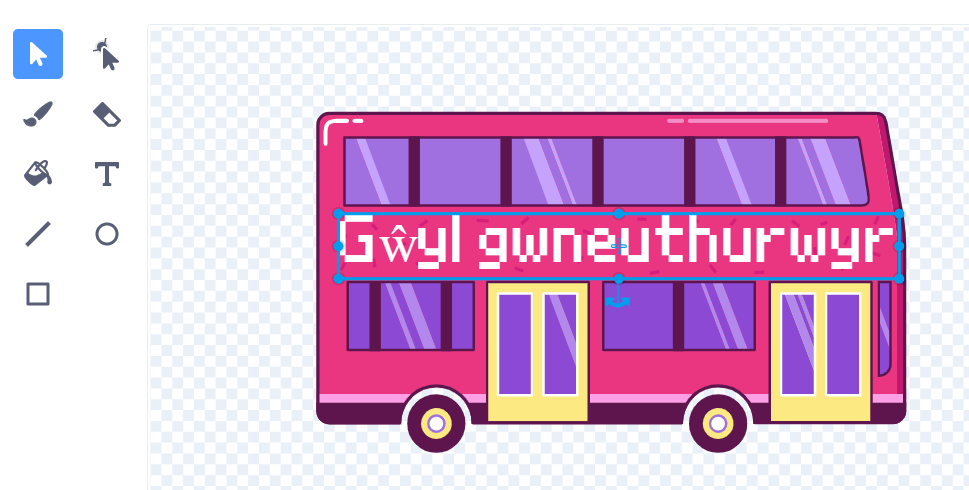

## Newid y gyrchfan

Mae'r ysgrifen ar y bws yn dweud "Scratch Tours", ond galli di newid y gyrchfan i un o dy ddewis di. Ble wyt ti am i dy fws fynd?  

{:width="300px"}

### Edit the City Bus sprite

--- task ---

Dewisa'r corlun **City Bus** a chlicio'r tab **Gwisgoedd**:

--- /task ---

--- task ---

Clicia'r testun gwyn "Scratch Tours" ac wedyn clicio ar **Dileu** i'w dynnu.

**Tip:** You can use the **Delete** icon in the Paint editor or the <kbd>Delete</kbd> key on your keyboard.

--- /task ---

--- task ---

Dewsia'r offeryn (ysgrifennu) **Testun**.

Clicia ar y bws lle rwyt ti am i dy destun ddechrau, a theipio'r gyrchfan o dy ddewis.

I newid y ffont (arddull ysgrifennu), galli di glicio'r ddewislen **Ffont**:

--- /task ---

--- task ---

Clicia'r offeryn **Dewis** (Saeth) ac wedyn llusgo'r testun i'w leoli ar y bws.

--- /task ---

