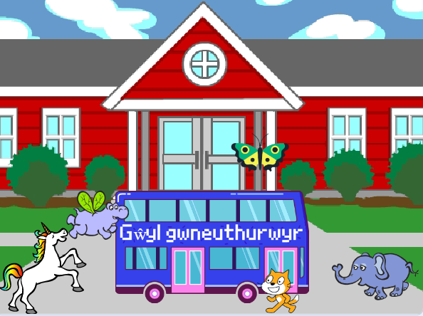

## Uwchraddio dy brosiect

Nawr, galli di ychwanegu corlun o dy ddewis at dy animeiddiad. Bydd angen i ti ychwanegu cod i wneud i dy gorlun `fynd i`{:class="block3motion"} leoliad dechreuol, `pwyntio`{:class="block3motion"} yn y cyfeiriad cywir, ac wedyn blociau `ailadrodd`{:class="block3control"} `symud`{:class="block3motion"} a `gwisg nesaf`{:class="block3looks"} i gyrraedd y bws.

**Awgrym:** Pan fyddi di'n clicio ar **Dewiswch Gorlun**, byddi di'n dal cyrchydd y llygoden dros gorlun i weld ei wisgoedd, neu ar rai ddyfeisiau symudol galli di daro a dal dros gorlun i weld ei wisgoedd (os bydd ffenestr yn ymddangos pan fyddi di'n taro a dal dros gorlun, tara ar ochr y sgrin i gau'r ffenestr a gweld y gwisgoedd). Gall edrych ar wisgoedd corluniau dy helpu i ddod o hyd i corlun sy'n gweithio'n dda ar gyfer animeiddio.

{:width="300px"}

Galli di ddefnyddio unrhyw un o'r blociau y gwnes di ddysgu amdanyn nhw yn y prosiect hwn, yn ogystal â'r rhai rwyt ti'n eu hadnabod eisoes:

```blocks3
when flag clicked

when [timer v] > [5]

go to x: [0] y: [0] // llusga'r corlun i ddewis x a y

show

hide

glide [2] secs to x: [0] y: [-100] // canol gwaelod y Llwyfan

repeat [30]
end

point towards (City Bus v)

point in direction (180) // pwyntio i lawr

set rotation style [left-right v]

move [3] steps

next costume

start sound [clown honk v]

wait [0.1] seconds // oedi byr

set [color v] effect to [50] // hyd at 200
```

--- collapse ---
---
teitl: Prosiect gorffenedig
---

Galli di weld y [prosiect wedi'i gwblhau yma](https://scratch.mit.edu/projects/626229210/){:target="_blank"}.

--- /collapse ---

Galli di hefyd 'ailgymysgu' y prosiect i wneud unrhyw newidiadau hoffet ti. Fe allet ti ychwanegu effeithiau sain i'r bws neu gorluniau eraill, neu osod effaith lliw y bws. Gallai un o'r corluniau fethu'r bws a pheidio â chuddio.

Diolch i'r gwneuthurwr digidol Lyla am anfon yr uwchraddiad gwych hwn!


--- save ---
