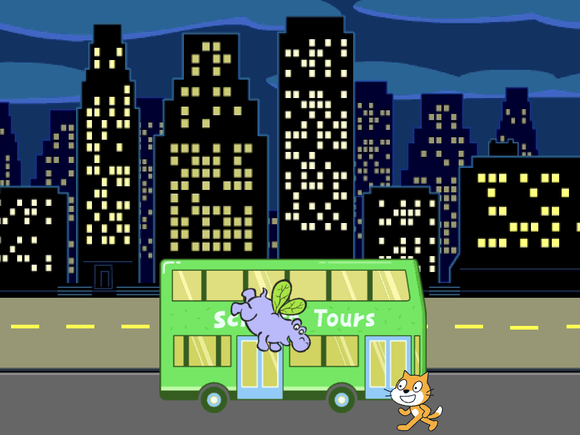

## Das wirst Du machen

Erstelle eine Animation mit Figuren, die rennen oder fliegen, um einen Bus 🚌 zu erreichen.

Du wirst:
+ Figuren verschiedene Dinge machen lassen ` wenn die grüne Flagge geklickt wird`{:class="block3events"}
+ Figuren auf der **Bühne** positionieren
+ Eine `wiederhole`{:class="block3control"}-Schleife benutzen, um Figuren zum `gehen`{:class="block3motion"} zu bringen, und `Kostüme zu wechseln`{:class="block3looks"}

--- no-print --- --- task ---

### Spielen ▶️

  

Klicke auf die grüne Flagge, um die Animation anzusehen. 

Welche Figuren wechseln ihre Kostüme, um einen Animationseffekt 🎥 zu erzeugen?

  <iframe allowtransparency="true" width="485" height="402" src="https://scratch.mit.edu/projects/embed/724160134/?autostart=false" frameborder="0"></iframe>

--- /task --- --- /no-print ---

--- print-only ---

--- /print-only ---

**Animation** erzeugt den Bewegungseffekt durch schnelle Bildwechsel. Die ersten Animatoren schnitzten Bilder aus Holzblöcken und verwendeten sie als Stempel. Es ist viel schneller, Scratch zum Programmieren deiner Animation zu verwenden!

