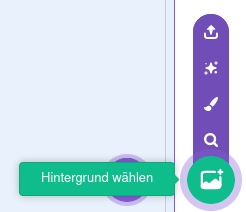
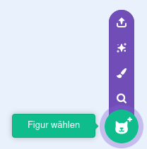
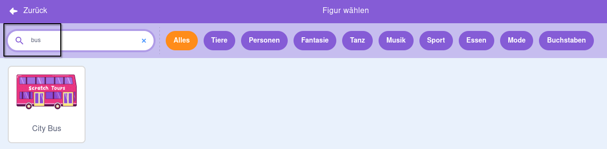
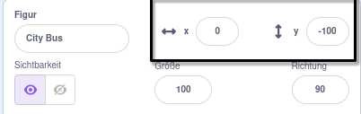
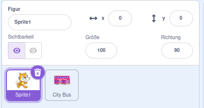
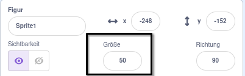

## Erstelle deine Busszene

<div style="display: flex; flex-wrap: wrap">
<div style="flex-basis: 200px; flex-grow: 1; margin-right: 15px;">
Wähle ein Hintergrundbild und füge eine Bus-Figur hinzu.
</div>
<div>

{:width="300px"}

</div>
</div>

### Öffne das Starterprojekt

--- task ---

Öffne das [Krieg den Bus Starterprojekt](https://scratch.mit.edu/projects/582214330/editor){:target="_blank"}. Scratch wird in einem anderen Tab im Browser geöffnet.

[[[working-offline]]]

--- /task ---

### Wähle ein Hintergrundbild

--- task ---

Klicke (oder tippe auf einem Tablet) auf **Hintergrund wählen** im Bühnenbereich (in der unteren rechten Ecke des Bildschirms):



--- /task ---

--- task ---

Klicke auf die Kategorie **Landschaften**. Füge ein Hintergrundbild hinzu, das sich gut als Abfahrtspunkt für deinen Bus eignet:


--- /task ---

### Wähle eine Figur

--- task ---

Klicke auf **Figur wählen**:



--- /task ---

--- task ---

Gib in das Suchfeld oben `Bus` ein:



Füge deinem Projekt die **City Bus** Figur hinzu.

--- /task ---

### Gib deinem Bus eine Startposition

--- task ---

Achte darauf, dass die **City Bus** Figur in der Figurenliste ausgewählt ist.

Ziehe einen Block `wenn grüne Flagge angeklickt wird`{:class="block3events"} Block aus dem Blockmenü `Ereignisse`{:class="block3events"} in den Codebereich:


```blocks3
when flag clicked
```

--- /task ---

--- task ---

Ziehe den Bus an eine gute Position auf der Bühne:


Die **x** und **y** Koordinaten (die zur Beschreibung der Position verwendeten Zahlen) des Busses werden im Figurenbereich unterhalb der Bühne angezeigt:



--- /task ---

--- task ---

Füge deinem Code einen Block `gehe zu x: y:`{:class="block3motion"} hinzu:


```blocks3
when flag clicked
+go to x: (0) y: (-100)
```

Die Zahlen im Block `gehe zu x: y:`{:class="block3motion"} sind die aktuellen x- und y-Koordinaten des Busses. Die Zahlen in deinem Projekt können etwas anders sein.

--- /task ---

--- task ---

**Test:** Ziehe den Bus an eine beliebige Stelle auf der Bühne und klicke dann auf die grüne Flagge. Der Bus sollte immer zu seiner Ausgangsposition zurückfahren.


--- /task ---

### Bewege den Bus hinter die Charakterfiguren

--- task ---

Um sicherzustellen, dass die **City Bus** Figur immer hinter allen Charakterfiguren liegt, füge eine `gehe zu vorderster Ebene`{:class="block3looks"} hinzu. Dann klicke auf `vorderster`{:class="block3looks"} und ändere es in `hinterster`{:class="block3looks"}:


```blocks3
when flag clicked
go to x: (0) y: (-100)
+ go to [hinterster v] layer
```

**Tipp:** Wenn du den `gehe zu vorderester Ebene`{:class="block3looks"} nicht siehst, musst du im Blockmenü in der `Aussehen`{:class="block3looks"} Kategorie runterscrollen.

--- /task ---

### Ändere die Busfarbe

--- task ---

Du kannst die Farbe des Busses ändern:


```blocks3
when flag clicked
go to x: (0) y: (-100)
go to [hinterster v] layer
+set [Farbe v] effect to (50) // Versuche Zahlen bis 200
```

--- /task ---

### Ändere die Größe der Scratch Katze

--- task ---

Die Scratch Katze erscheint in allen neuen Scratch-Projekten als **Sprite1** in der Figurenliste. Klicke in der Figurenliste auf die Figur **Sprite1**, um die Animation der Scratch Katze vorzubereiten:



**Tipp:** Wenn du aus Versehen **Sprite1** (die Scratch Katze) gelöscht hast, kannst du auf das **Figur wählen** Zeichen klicken und nach `cat` (engl.: Katze) suchen.

--- /task ---

--- task ---

Klicke im Figurenbereich auf **Größe** und ändere die Größe der Scratch Katze auf `50`:



--- /task --- 
