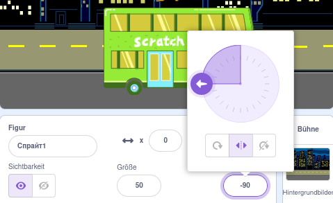
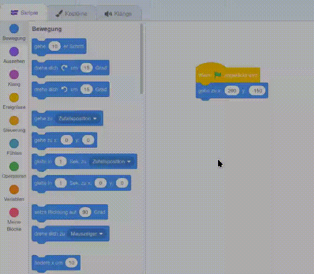

## Die Scratch Katze erreicht den Bus

<div style="display: flex; flex-wrap: wrap">
<div style="flex-basis: 200px; flex-grow: 1; margin-right: 15px;">
Animiere die Scratch Katze so, dass sie auf der **rechten Seite** der Bühne erscheint und zum Bus läuft, indem du eine kleine Bewegung viele Male in einer **Schleife** wiederholst. 
</div>
<div>

{:width="300px"}

</div>
</div>

### Bringe die Scratch Katze in ihre Ausgangsposition

--- task ---

Klicke im Figurenbereich auf die Eigenschaft **Richtung**. Drehe den Pfeil so, dass er auf `-90`zeigt. Klicke dann auf das Symbol **Links/Rechts** in der Mitte, um den Rotationsstil auf `Links-Rechts` zu ändern und so zu verhindern, dass sich die Scratch Katze auf den Kopf stellt:



--- /task ---

--- task ---

Ziehe die Scratch Katze auf die rechte untere Seite der Bühne.


**Tipp:** Wenn du versuchst, eine Figur außerhalb der Bühne zu positionieren, wird sie an seine letzte Position auf der Bühne zurückbewegt.

--- /task ---

--- task ---

Füge Code hinzu, um die Scratch Katze an ihre Startposition zu bringen:


```blocks3
when flag clicked
go to x:(200) y:(-150) // unten rechts
```

--- /task ---

--- task ---

**Test:** Ziehe die Scratch Katze an eine neue Position und klicke dann auf ihren Block `gehe zu x: y:`{:class="block3motion"}. Die Scratch Katze sollte sich jedes Mal wieder nach unten rechts bewegen.

--- /task ---

### Animiere die Scratch Katze

Du fügst Code in einer `wiederhole`{:class="block3control"}-Schleife hinzu, damit die Scratch Katze eine kleine Anzahl von Schritten viele Male wiederholt. Dadurch erscheint die Scratch Katze animiert.

--- task ---

Füge einen Block `wiederhole`{:class="block3control"} `10` mal hinzu und ziehe dann einen Block `gehe`{:class="block3motion"} `10`er `Schritt`{:class="block3motion"} in den Wiederholungsblock hinein:




```blocks3
when flag clicked
go to x:(200) y:(-150) // unten rechts
+ repeat (10) // Probiere verschiedene Zahlen aus
move (5) steps //  5 ist eine gute Gehgeschwindigkeit
end
```

--- /task ---

--- task ---

**Test:** Klicke auf die grüne Flagge. Versuche mal, die Zahlen im `wiederhole`{:class="block3control"} `10` mal Block so zu ändern, dass die Scratch Katze am Bus anhält.

--- /task ---

Manche Figuren haben mehr als ein Kostüm. Du wirst die Kostüme der **Scratch Katze** Figur verwenden, um eine Animation des Spaziergangs der Scratch Katze zu erstellen.

--- task ---

Klicke auf die Registerkarte **Kostüme**. Die **Scratch Katze** Figur hat zwei Kostüme und zusammen können sie verwendet werden, um eine Gehbewegung darzustellen.

--- /task ---

--- task ---

Klicke auf das **Skripte** Register. Füge den Block `Wechsle zum nächstes Kostüm`{:class="block3looks"} in die `wiederhole fortlaufend`{:class="block3control"} Schleife ein:


```blocks3
when flag clicked
go to x:(200) y:(-150) // unten rechts
repeat (20) // Probiere verschiedene Zahlen aus
move (5) steps //  5 ist eine gute Gehgeschwindigkeit
+ next costume 
end
```
--- /task ---

--- task ---

**Test:** Klicke auf die grüne Flagge und die Scratch Katze läuft zum Bus.

--- /task ---

### Verstecke die Scratch Katze

--- task ---

Füge einen `verstecke dich`{:class="block3looks"} Block hinzu, um die Scratch Katze zu verstecken, wenn sie den Bus erreicht:


```blocks3
when flag clicked
go to x:(200) y:(-150) // unten rechts
repeat (20) // Probiere verschiedene Zahlen aus
move (5) steps //  5 ist eine gute Gehgeschwindigkeit
next costume 
end
+ hide
```

--- /task ---

--- task ---

**Test:** Klicke erneut auf die grüne Flagge und du wirst sehen, dass die Scratch Katze jetzt verschwunden ist.

--- /task ---

### Zeige die Scratch Katze

--- task ---

Füge einen `zeige dich`{:class="block3looks"} Block hinzu, damit die Scratch Katze erscheint, bevor sie zum Bus läuft:


```blocks3
when flag clicked
go to x:(200) y:(-150) // unten rechts
+ show
repeat (20) // Probiere verschiedene Zahlen aus
move (5) steps //  5 ist eine gute Gehgeschwindigkeit
next costume 
end
hide
```

**Tipp:** Wenn du einen `verstecke dich`{:class="block3looks"} Block verwendest, musst du auch einen `zeige dich`{:class="block3looks"} Block hinzufügen, um sicherzustellen, dass eine Figur bei Bedarf sichtbar ist.

--- /task ---

--- task ---

**Test:** Klicke auf die grüne Flagge, um dein Projekt zu testen, und stelle sicher, dass die Scratch Katze erscheint.

--- /task ---

