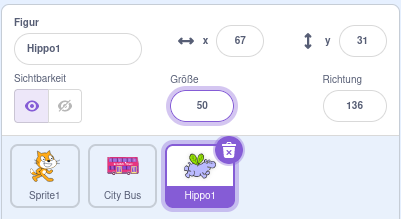

## Das Nilpferd fliegt zum Bus

<div style="display: flex; flex-wrap: wrap">
<div style="flex-basis: 200px; flex-grow: 1; margin-right: 15px;">
Füge eine Nilpferd-Figur hinzu, die zum Bus fliegt.
</div>
<div>

{:width="300px"}

</div>
</div>

### Gib dem Nilpferd eine Ausgangsposition

--- task ---

Füge die **Hippo1** Figur zu deinem Projekt hinzu.

Ändere die **Größe** der **Hippo1** Figur:



--- /task ---

--- task ---

Ziehe das Nilpferd an die obere linke Seite der Bühne.


--- /task ---

--- task ---

Füge Code hinzu, um das Nilpferd an seine Startposition zu bringen:

```blocks3
when flag clicked
go to x: [-200] y: [150] // top left-hand side
```

**Tipp:** Die `x`{:class="block3motion"} und `y`{:class="block3motion "}-Koordinaten im Block `gehe zu x: y:`{:class="block3motion"} sind die aktuelle Position des Nilpferds. Sie müssen nicht eingeben werden.

--- /task ---

### Lass das Nilpferd mit den Flügeln schlagen und fliegen

--- task ---

Füge Code hinzu, damit das Nilpferd zum **Stadtbus** fliegt:

```blocks3
when flag clicked
go to x: [-200] y: [150] 
+repeat [100] 
point towards (City Bus v) // change from mouse-pointer
move [3] steps
next costume
+end
```

--- /task ---

--- task ---

**Test:** Klicke auf die grüne Flagge und überprüfe, ob das Nilpferd zum Bus fliegt. Du kannst die Zahl im Block `wiederhole`{:class="block3control"} ändern, damit das Nilpferd genau an der richtigen Stelle anhält.

--- /task ---

### Den Bus ein- und ausblenden

--- task ---

Füge die Blöcke `zeige dich`{:class="block3looks"} und `verstecke dich`{:class="block3looks"} hinzu:

```blocks3
when flag clicked
go to x: [-200] y: [150] 
+ show
repeat [90] 
point towards (City Bus v)
move [3] steps
next costume
end
+ hide
```

--- /task ---

--- task ---

**Test:** Klicke auf die grüne Flagge. Das Nilpferd wird fliegen und in den Bus einsteigen.

--- /task ---
