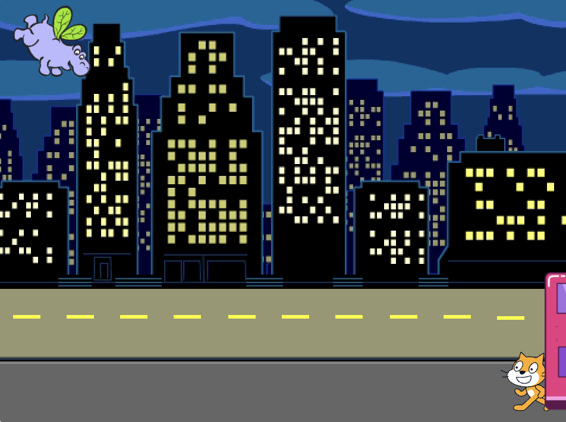

## Der Bus fährt ab

<div style="display: flex; flex-wrap: wrap">
<div style="flex-basis: 200px; flex-grow: 1; margin-right: 15px;">
Füge weitere Blöcke hinzu, damit der Bus losfährt.
</div>
<div>

{:width="300px"}

</div>
</div>

### Animiere den Bus

--- task ---

Wähle die **City Bus** Figur aus.


--- /task ---

--- task ---

Füge Code hinzu, damit der Bus vier Sekunden nach dem Anklicken der grünen Flagge nach rechts abfährt.


```blocks3
when flag clicked 
wait [4] seconds // ändere 1 auf 4
```

--- /task ---

--- task ---

Ziehe den Bus auf die rechte Seite der Bühne. Dies ist die Position `x`{:class="block3motion"} und `y`{:class="block3motion"}, zu der der Bus `gleiten`{:class="block3motion"} wird.



**Tipp:** Wenn du den Bus zu weit nach rechts bewegst, springt er zurück. Versuche es erneut, aber gehe nicht so weit.

--- /task ---

--- task ---

Füge unter dem Block `warte`{:class="block3control"} einen Block `gleite in`{:class="block3motion"} `2` `Sek. zu x: y:`{:class="block3motion"} hinzu.

In deinem Projekt können die Koordinaten `x`{:class="block3motion"} und `y`{:class="block3motion"} etwas anders sein und entsprechen der genauen Position, an die du den Bus gezogen hast.


```blocks3
when flag clicked 
wait [4] seconds // ändere 1 auf 4
+glide [2] secs to x: [320] y: [-100] // rechte Seite der Bühne
```

--- /task ---

--- task ---

**Test:** Klicke auf die grüne Flagge. Die Scratch Katze und das Nilpferd bewegen sich zum Bus, und der Bus fährt nach vier Sekunden nach rechts los.

--- /task ---

### Bus ausblenden und anzeigen

--- task ---

Füge einen `verstecke dich`{:class="block3looks"}-Block hinzu, damit es so aussieht, als würde der Bus von der Bühne fahren:


```blocks3
when flag clicked 
wait [4] seconds // ändere 1 auf 4
glide [2] secs to x: [320] y: [-100]
+ hide
```
--- /task ---

--- task ---

**Test:** Klicke auf die grüne Flagge. Der Bus wird sich nun nach der Abfahrt verstecken. Erinnerst du dich, wie das geht, dass eine Figur erneut erscheint, wenn du auf die grüne Flagge klickst?

--- /task ---

--- task ---

Füge einen `zeige dich`{:class="block3looks"}-Block zu deinem `Wenn grüne Flagge angeklickt wird`{:class="block3events"}-Skript hinzu, damit der Bus beim Ausführen deines Projekts angezeigt wird:


```blocks3
when flag clicked
go to x: (0) y: (-100)
go to [back v] layer
set [color v] effect to (85) // Versuche Zahlen bis 200
+show
```

--- /task ---

--- task ---

**Test:** Klicke auf die grüne Flagge und schau dir deine Animation an. Der Bus sollte in der Mitte der Bühne erscheinen, dann nach rechts abfahren und verschwinden.

Sind alle im Bus, wenn er abfährt? Du kannst die Wartezeit des Busses bei Bedarf ändern.

--- /task ---
