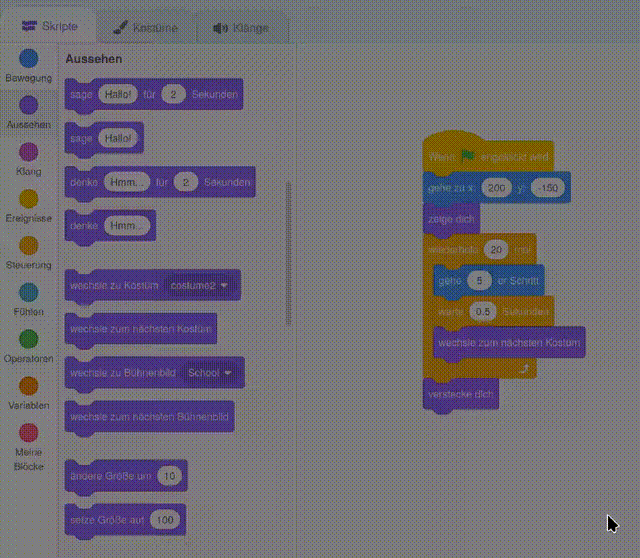

## Den Bus verpasst

<div style="display: flex; flex-wrap: wrap">
<div style="flex-basis: 200px; flex-grow: 1; margin-right: 15px;">
Was wäre, wenn die Scratch Katze nicht schnell genug rennen würde, um den Bus zu erwischen?
</div>
<div>

{:width="300px"}

</div>
</div>

### Lass Scratch Katze den Bus verpassen

--- task ---

Wähle die **Scratch Katze** Figur und füge einen Block `warte`{:class="block3control"} hinzu:


```blocks3
when flag clicked
go to x:(200) y:(-150) 
show
repeat (20) // try different numbers
move (5) steps 
next costume 
+ wait (1) seconds
end
hide
```
--- /task ---

--- task ---

**Test:** Klicke auf die grüne Flagge. Die Scratch Katze läuft zu langsam und verpasst den Bus!

--- /task ---

### Lass Scratch Katze den Bus erwischen

--- task ---

Du brauchst Verzögerungen von weniger als eine Sekunde. 0,5 ist eine halbe Sekunde, 0,25 ist eine Viertelsekunde und 0,1 ist eine Zehntelsekunde.

Ändere die Verzögerung im Block `warte`{:class="block3control"}:


```blocks3
wait (0.2) seconds // try 0.1, 0.5, 0.05
```

**Test:** Klicke auf die grüne Flagge und die Scratch Katze läuft schneller. Wähle die Verzögerung, die dir am besten gefällt.

--- /task ---

### Entscheide dich, ob die Scratch Katze den Bus erwischt oder verpasst

--- task ---

Wenn du möchtest, dass die Scratch Katze **den Bus verpasst**, entferne den Block `verstecke dich`{:class="block3looks"} aus deinem Code, damit die Scratch Katze auf der Bühne bleibt:




```blocks3
when flag clicked
go to x:(200) y:(-150) 
show
repeat (20) 
move (5) steps 
next costume
wait (0.5) seconds 
end
-hide
```
--- /task ---

--- task ---

Wenn du möchtest, dass die Scratch Katze **den Bus erwischt**, lasse den Bus länger warten, bevor er abfährt:


```blocks3
when flag clicked 
+wait [4] seconds // change from 4 to 6
glide [2] secs to x: [320] y: [-100] // right-hand side of the Stage
hide
```

Wenn du im letzten Schritt den Block `verstecke dich`{:class="block3looks"} entfernt hast, und möchtest, dass die **Scratch Katze** den Bus doch erwischen soll, musst du ihn wieder einfügen.

--- /task ---

--- task ---

Nehme Änderungen vor, bis die Animation deinen Wünschen entspricht.

--- /task ---

<p style="border-left: solid; border-width:10px; border-color: #0faeb0; background-color: aliceblue; padding: 10px;">
Wenn du an einem Projekt arbeitest, ist es normal, oft zurück an frühere Stellen zu gehen und Veränderungen oder Verbesserungen an deinen Code zu machen, wenn dir neue Ideen kommen. 
</p>


