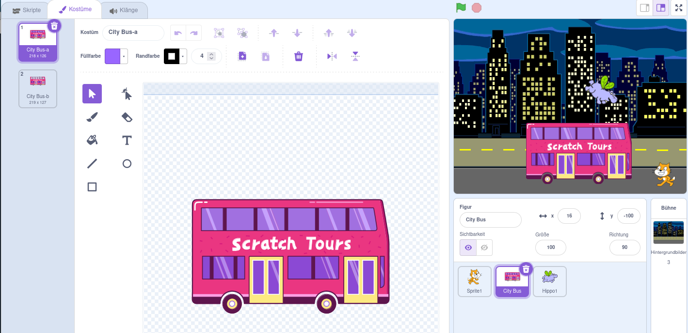
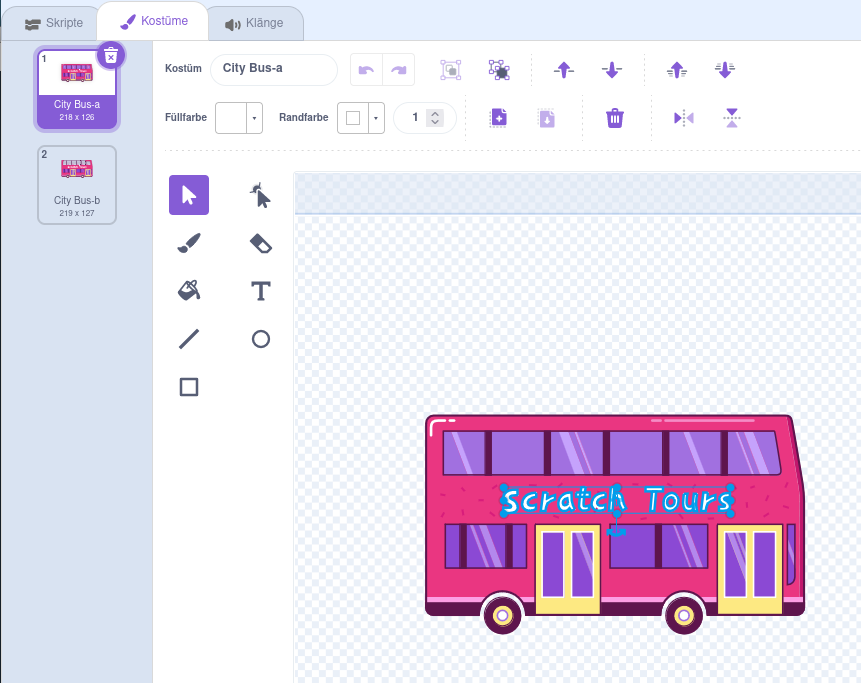

## Ändere das Ziel

Die Aufschrift auf dem Bus lautet „Scratch Tours“, aber du kannst das Ziel nach Belieben ändern. Wohin soll dein Bus fahren?  

{:width="300px"}

### Bearbeite die Figur Stadtbus

--- task ---

Wähle die Figur **City Bus** und klicke auf den Tab **Kostüme**:

--- /task ---

--- task ---

Klicke auf den weißen Text „Scratch Tours“, um ihn auszuwählen, und klicke dann auf **Löschen**, um ihn zu entfernen.

**Tipp:** Du kannst das **Löschen** Symbol (der Mülleimer) im Paint-Editor, oder die Taste <kbd>Entf</kbd> auf deiner Tastatur verwenden.

--- /task ---

--- task ---

Wähle das **Text**werkzeug (Schreiben) aus.

Klicke auf der Stelle auf den Bus, bei dem dein Text beginnen soll, und gebe das gewünschte Ziel ein.

Um die Schriftart (den Schreibstil) zu ändern, kannst du auf das Dropdown-Menü **Schriftarten** klicken:

--- /task ---

--- task ---

Klicke auf das Werkzeug **Auswählen** (Pfeil) und ziehe dann den Text, um ihn auf dem Bus zu positionieren.

--- /task ---

