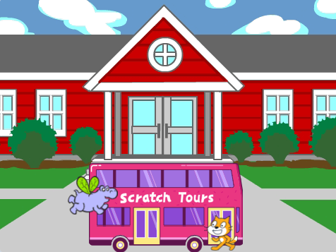

## You will make

Create an animation with sprites that run or fly to catch a bus 🚌.

Θα χρειαστεί να:
+ Προγραμματίσεις τα sprites να κάνουν διαφορετικά πράγματα `όταν η πράσινη σημαία πατηθεί`{:class="block3events"}
+ Τοποθετήσεις τα αντικείμενα στο **Σκηνικό**
+ Χρησιμοποιήσεις ένα `μπλοκ επαναλήψης`{:class="block3control"} για να `κινήσεις`{:class="block3motion"} τα αντικείμενα και `να αλλάξουν ενδυμασίες`{:class="block3looks"}

--- no-print --- --- task ---

### Play ▶️

  

Κάνε κλικ στην πράσινη σημαία για να δεις την κινούμενη εικόνα. 

Which sprites change their costumes to create an animation 🎥 effect?

  <iframe allowtransparency="true" width="485" height="402" src="https://scratch.mit.edu/projects/embed/724160134/?autostart=false" frameborder="0"></iframe>

--- /task --- --- /no-print ---

--- print-only ---

--- /print-only ---

**Κινούμενη εικόνα** δημιουργεί το εφέ της κίνησης αλλάζοντας γρήγορα τις εικόνες. Οι πρώτοι σχεδιαστές κινουμένων σχεδίων χάραξαν εικόνες από ξύλινα κομμάτια και τις χρησιμοποίησαν ως στάμπες. Είναι πολύ πιο γρήγορο να χρησιμοποιείς το Scratch για να προγραμματίσεις το κινούμενο σχέδιο σου!

