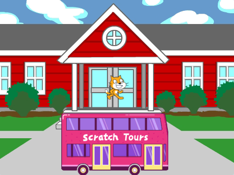
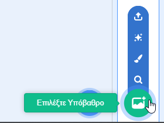
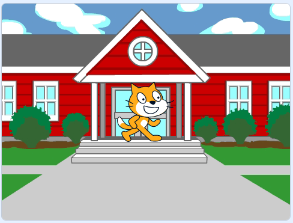
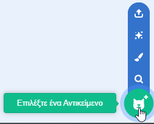
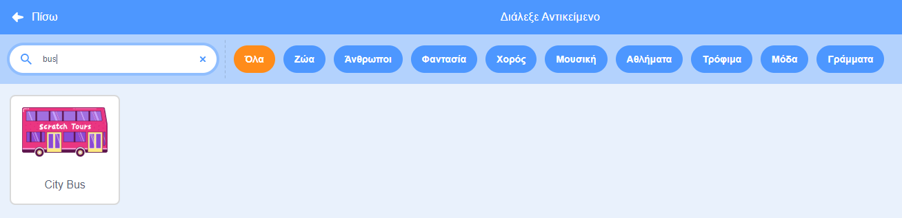
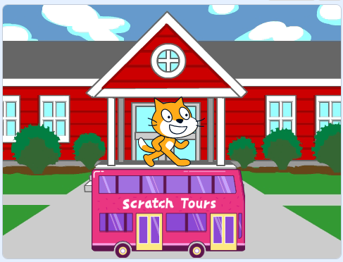
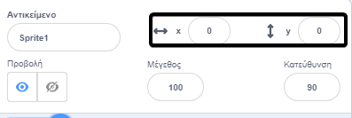
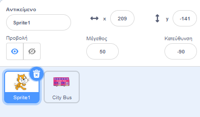
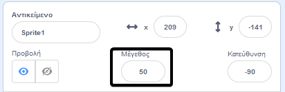

## Δημιούργησε την σκηνή σου

<div style="display: flex; flex-wrap: wrap">
<div style="flex-basis: 200px; flex-grow: 1; margin-right: 15px;">
Θα επιλέξεις ένα σκηνικό και θα προσθέσεις ένα αντικείμενο λεωφορείου.
</div>
<div>

{:width="300px"}

</div>
</div>

### Άνοιξε το αρχικό έργο

--- task ---

Άνοιξε το έργο [Πρόλαβε το λεωφορείο](https://scratch.mit.edu/projects/582214330/editor){:target="_blank"}. Το Scratch θα ανοίξει σε νέα καρτέλα του φυλλομετρητή.

[[[working-offline]]]

--- /task ---

### Διάλεξε ένα Υπόβαθρο

--- task ---

Κάνε κλικ (ή σε ένα tablet, πάτησε) στο **Επιλέξτε ένα Υπόβαθρο** στο παράθυρο Σκηνή(στην κάτω δεξιά γωνία της οθόνης):



--- /task ---

--- task ---

Κάνε κλικ στην κατηγορία **Εξωτερικοί χώροι**. Πρόσθεσε ένα σκηνικό που αποτελεί καλό σημείο εκκίνησης για το λεωφορείο σου:



--- /task ---

### Επίλεξε ένα Αντικείμενο

--- task ---

Κάνε κλικ στο **Επέλεξε ένα Αντικείμενο** για να ανοίξεις τη Λίστα Αντικειμένων:



--- /task ---

--- task ---

Πληκτρολόγησε `bus` στο πλαίσιο αναζήτησης στην κορυφή:



Πρόσθεσε το αντικείμενο **City Bus** στο έργο σου.

--- /task ---

### Βάλε το λεωφορείο σου σε μια αρχική θέση

--- task ---

Βεβαιώσου ότι το αντικείμενο **City Bus** είναι επιλεγμένο στη λίστα Αντικειμένων κάτω από την Σκηνή.

Σύρε ένα μπλοκ `όταν η πράσινη σημαία γίνει κλικ`{:class="block3events"} από το μενού `συμβάντων`{:class="block3events"} στην περιοχή του Κώδικα:


```blocks3
when flag clicked
```

--- /task ---

--- task ---

Σύρε το λεωφορείο σε μια καλή θέση στη Σκηνή:



Οι συντεταγμένες **x** και **y** (οι αριθμοί που χρησιμοποιούνται για την περιγραφή της θέσης) του λεωφορείου εμφανίζονται στο παράθυρο Αντικειμένου κάτω από την Σκηνή:



--- /task ---

--- task ---

Πρόσθεσε ένα μπλοκ `πήγαινε σε θέση x, y`{:class="block3motion"}:


```blocks3
when flag clicked
+go to x: (0) y: (-100)
```

Οι αριθμοί στο `πήγαινε σε θέση x, y`{:class="block3motion"} είναι οι τρέχουσες συντεταγμένες x και y του λεωφορείου. Οι αριθμοί στο έργο σου μπορεί να είναι λίγο διαφορετικοί.

--- /task ---

--- task ---

**Δοκιμή:** Σύρε το λεωφορείο σε οποιοδήποτε σημείο της Σκηνής και μετά κάνε κλικ στην πράσινη σημαία. Το λεωφορείο πρέπει πάντα να πηγαίνει στην αρχική του θέση.


--- /task ---

### Μετακίνησε το λεωφορείο πίσω από τα αντικείμενα

--- task ---

Για να βεβαιωθείς ότι το **City Bus** βρίσκεται πάντα πίσω από όλους τα αντικείμενα, πρόσθεσε ένα μπλοκ `πήγαινε σε επίπεδο προσκήνιο`{:class="block3looks"}, κάνε κλικ στο `προσκήνιο`{:class="block3looks"} και άλλαξέ το σε `κάτω υπόβαθρο`{:class="block3looks"}:


```blocks3
when flag clicked
go to x: (0) y: (-100)
+ go to [back v] layer
```

**Συμβουλή:** Εάν δεν μπορείς να δεις το `πήγαινε σε επίπεδο προσκήνιο`{:class="block3looks"}, πρέπει να σκρολάρεις προς τα κάτω στο μενού `Όψεις`{:class="block3looks"}.

--- /task ---

### Άλλαξε το χρώμα του λεωφορείου

--- task ---

Μπορείς να αλλάξεις το χρώμα του λεωφορείου:


```blocks3
when flag clicked
go to x: (0) y: (-100)
go to [back v] layer
+set [color v] effect to (50) // δοκίμασε αριθμούς έως 200
```

--- /task ---

### Άλλαξε μέγεθος στη γάτα (Cat) του Scratch

--- task ---

Η γάτα (Cat) του Scratch εμφανίζεται σε όλα τα νέα έργα Scratch ως **Sprite1** στη λίστα Αντικείμενων. Κάνε κλικ στο αντικείμενο **Sprite1** στη λίστα Αντικειμένων για να δημιουργήσεις κινούμενη εικόνα με την γάτα του Scratch:



**Συμβουλή:** Εάν διέγραψες κατά λάθος το **Sprite1** (γάτα του Scratch), μπορείς να κάνεις κλικ στο εικονίδιο **Επιλέξτε ένα Aντικείμενο** και να αναζητήσεις το `Cat`.

--- /task ---

--- task ---

Αυτή τη στιγμή, η γάτα του Scratch είναι πολύ μεγάλη για να χωρέσει στο λεωφορείο.



--- /task --- 
