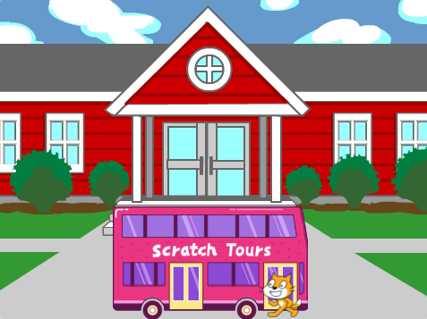
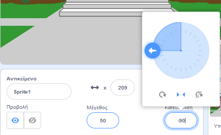
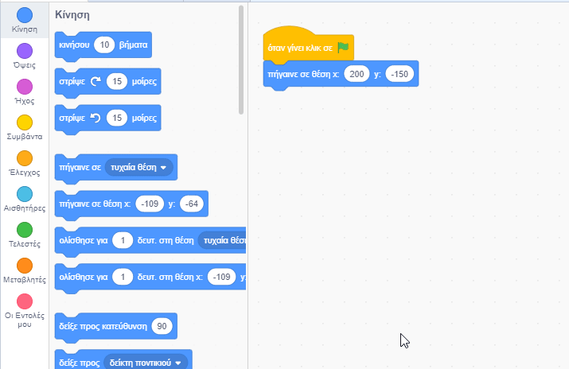

## Η γάτα του Scratch προλαβαίνει το λεωφορείο

<div style="display: flex; flex-wrap: wrap">
<div style="flex-basis: 200px; flex-grow: 1; margin-right: 15px;">
Θα προγραμματίσεις την γάτα του Scratch να εμφανιστεί στη **δεξιά πλευρά** της Σκηνής και να περπατήσει μέχρι το λεωφορείο επαναλαμβάνοντας μια μικρή κίνηση πολλές φορές σε **βρόχο**. 
</div>
<div>

{:width="300px"}

</div>
</div>

### Βάλε την γάτα του Scratch στην αρχική της θέση

--- task ---

Κάνε κλικ στο αντικείμενο **bug** στη λίστα αντικειμένων. Περίστρεψε το βέλος για να δείξει στο `-90`. Στη συνέχεια, κάνε κλικ στο εικονίδιο **Αριστερά/Δεξιά** στη μέση για να αλλάξεις το στυλ περιστροφής σε `αριστερά-δεξιά` για να σταματήσεις την γάτα του Scratch από το να γυρίζει ανάποδα:



--- /task ---


--- task ---

Σύρε το αντικείμενο της γάτας του Scratch για να το τοποθετήσεις στην δεξιά πλευρά της Σκηνής.


**Συμβουλή:** Εάν προσπαθήσεις να τοποθετήσεις ένα αντικείμενο έξω από την Σκηνή, θα επιστρέψει στην τελευταία του θέση στην Σκηνή.

--- /task ---

--- task ---

Πρόσθεσε κώδικα για να φέρεις την γάτα του Scratch στην αρχική της θέση:


```blocks3
when flag clicked
go to x:(200) y:(-150) // κάτω δεξιά πλευρά
```

--- /task ---

--- task ---

**Δοκιμή:** Σύρε την γάτα του Scratch σε μια νέα θέση και, στη συνέχεια, κάνε κλικ στο μπλοκ `πήγαινε σε θέση x: y:`{:class="block3motion"}. Η γάτα του Scratch θα πρέπει να μετακινηθεί πίσω στην κάτω δεξιά πλευρά κάθε φορά.

--- /task ---

### Δώσε κίνηση στην γάτα του Scratch

Θα προσθέσεις κώδικα σε έναν βρόχο `επανάλαβε`{:class="block3control"} για να κάνεις την γάτα του Scratch να επαναλαμβάνει έναν μικρό αριθμό βημάτων πολλές φορές. Αυτό θα κάνει την γάτα του Scratch να φαίνεται ότι κινείται.

--- task ---

Πρόσθεσε ένα μπλοκ `επανάλαβε`{:class="block3control"} `10`, στη συνέχεια, σύρε ένα μπλοκ `κινήσου`{:class="block3motion"} `10` `βήματα`{:class="block3motion"} μέσα σε αυτό:




```blocks3
when flag clicked
go to x:(200) y:(-150) // κάτω δεξιά πλευρά
+ repeat (10) // δοκίμασε διαφορετικούς αριθμούς
move (5) steps //  Το 5 είναι μια καλή ταχύτητα βάδισης
end
```

--- /task ---

--- task ---

**Δοκιμή:** Κάνε κλικ στην πράσινη σημαία. Δοκίμασε να αλλάξεις τους αριθμούς στο μπλοκ `επανάλαβε`{:class="block3control"} `10` έτσι ώστε η γάτα (Cat) του Scratch να σταματήσει στο λεωφορείο.

--- /task ---

Ορισμένα αντικείμενα έχουν περισσότερες από μια ενδυμασίες. Θα χρησιμοποιήσεις τις ενδυμασίες του αντικειμένου **Scratch Cat** για να δημιουργήσεις μια κινούμενη εικόμα της γάτας του Scratch που περπατάει.

--- task ---

Κάνε κλικ στην καρτέλα **Ενδυμασίες**. Το αντικείμενο **Scratch Cat** έχει δύο ενδυμασίες και μαζί, μπορούν να χρησιμοποιηθούν για να δημιουργήσεις μια κίνηση περπατήματος.

--- /task ---

--- task ---

Κάνε κλικ στην καρτέλα **Κώδικας**. Πρόσθεσε ένα μπλοκ `επόμενη ενδυμασία`{:class="block3looks"}:


```blocks3
when flag clicked
go to x:(200) y:(-150) // κάτω δεξιά πλευρά
repeat (20) // δοκίμασε διαφορετικούς αριθμούς
move (5) steps //  Το 5 είναι μια καλή ταχύτητα βάδισης
+ next costume 
end
```
--- /task ---

--- task ---

**Δοκιμή:** Κάνε κλικ στην πράσινη σημαία και η γάτα του Scratch θα περπατήσει μέχρι το λεωφορείο.

--- /task ---

### Εξαφάνισε τη γάτα του Scratch (Cat)

--- task ---

Πρόσθεσε ένα μπλοκ `εξαφανίσου`{:class="block3looks"} στην γάτα του Scratch όταν φτάσει στο λεωφορείο:


```blocks3
when flag clicked
go to x:(200) y:(-150) // κάτω δεξιά πλευρά
repeat (20) // δοκίμασε διαφορετικούς αριθμούς
move (5) steps //  Το 5 είναι μια καλή ταχύτητα βάδισης
next costume 
end
+ hide
```

--- /task ---

--- task ---

**Δοκιμή:** Κάνε ξανά κλικ στην πράσινη σημαία και θα δεις ότι η γάτα του Scratch έχει πλέον εξαφανιστεί.

--- /task ---

### Εμφάνισε τη γάτα του Scratch

--- task ---

Πρόσθεσε ένα μπλοκ`εμφανίσου`{:class="block3looks"} έτσι ώστε να εμφανίζεται η γάτα του Scratch πριν περπατήσει προς το λεωφορείο:


```blocks3
when flag clicked
go to x:(200) y:(-150) // κάτω δεξιά πλευρά
+ show
repeat (20) // δοκίμασε διαφορετικούς αριθμούς
move (5) steps //  Το 5 είναι μια καλή ταχύτητα βάδισης
next costume 
end
hide
```

**Συμβουλή:** Όταν χρησιμοποιείς ένα μπλοκ `εξαφανίσου`{:class="block3looks"}, πρέπει επίσης να προσθέσεις ένα μπλοκ `εμφανίσου`{:class="block3looks"} για να βεβαιωθείς ότι ένα αντικείμενο είναι ορατό όταν χρειάζεται να είναι.

--- /task ---

--- task ---

**Δοκιμή:** Κάνε κλικ στην πράσινη σημαία για να δοκιμάσεις το έργο σου και βεβαιώσου ότι εμφανίζεται η γάτα του Scratch.

--- /task ---

