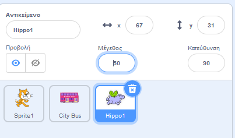
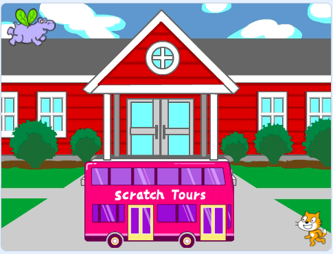

## Ο ιπποπόταμος πετάει προς το λεωφορείο

<div style="display: flex; flex-wrap: wrap">
<div style="flex-basis: 200px; flex-grow: 1; margin-right: 15px;">
Θα προσθέσεις έναν ιπποπόταμο που πετάει προς το λεωφορείο.
</div>
<div>

{:width="300px"}

</div>
</div>

### Βάλε το Hippo σε μια αρχική θέση

--- task ---

Πρόσθεσε το αντικείμενο **Hippo1** στο έργο σου.

Άλλαξε το **Μέγεθος** του αντικειμένου **Hippo1**:



--- /task ---

--- task ---

Σύρε τον ιπποπόταμο στην επάνω αριστερή πλευρά της Σκηνής.



--- /task ---

--- task ---

Πρόσθεσε κώδικα για να φέρεις τον ιπποπόταμο στην αρχική του θέση:

```blocks3
when flag clicked
go to x: [-200] y: [150] // top left-hand side
```

**Συμβουλή:** Οι συντεταγμένες `x`{:class="block3motion"} και `y`{:class="block3motion"} στο μπλοκ `πήγαινε σε θέση x: y:`{:class="block3motion"} θα είναι η τρέχουσα θέση του ιπποπόταμου, επομένως δεν χρειάζεται να τις πληκτρολογήσεις.

--- /task ---

### Κάνε τον Hippo να χτυπάει τα φτερά του και να πετάει

--- task ---

Πρόσθεσε κώδικα για να κάνεις τον ιπποπόταμο να πετάξει προς το **City Bus**:

```blocks3
when flag clicked
go to x: [-200] y: [150] 
+repeat [100] 
point towards (City Bus v) // change from mouse-pointer
move [3] steps
next costume
+end
```

--- /task ---

--- task ---

**Δοκιμή:** Κάνε κλικ στην πράσινη σημαία και έλεγξε ότι ο ιπποπόταμος πετάει προς το λεωφορείο. Μπορείς να αλλάξεις τον αριθμό στο μπλοκ `επανάλαβε`{:class="block3control"} για να κάνεις τον ιπποπόταμο να σταματήσει στο σωστό σημείο.

--- /task ---

### Εμφάνισε και εξαφάνισε το λεωφορείο

--- task ---

Πρόσθεσε μπλοκ `εμφανίσου`{:class="block3looks"} και `εξαφανίσου`{:class="block3looks"}:

```blocks3
when flag clicked
go to x: [-200] y: [150] 
+ show
repeat [90] 
point towards (City Bus v)
move [3] steps
next costume
end
+ hide
```

--- /task ---

--- task ---

**Δοκιμή:** Κάνε κλικ στην πράσινη σημαία. Ο ιπποπόταμος θα πετάξει και θα μπει στο λεωφορείο.

--- /task ---
