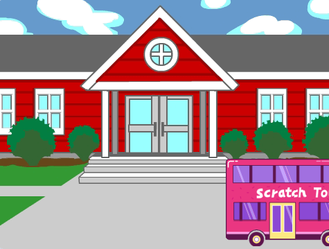
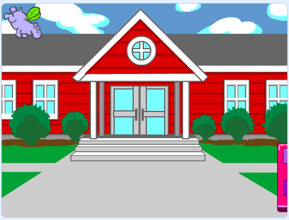

## Το λεωφορείο φεύγει

<div style="display: flex; flex-wrap: wrap">
<div style="flex-basis: 200px; flex-grow: 1; margin-right: 15px;">
Μια ομάδα συνδεδεμένων μπλοκ στο Scratch ονομάζεται **script**. Θα προσθέσεις ένα νέο script για να φύγει το λεωφορείο.
</div>
<div>

{:width="300px"}

</div>
</div>

Το λεωφορείο θα φύγει προς τα δεξιά τέσσερα δευτερόλεπτα αφού πατηθεί η πράσινη σημαία. Το μπλοκ `όταν το χρονόμετρο`{:class="block3events"} θα εκτελέσει τα μπλοκ κάτω από αυτό μετά από αυτήν τη χρονική καθυστέρηση.

--- task ---

Επίλεξε το Αντικείμενο **Αστικό λεωφορείο**.


--- /task ---

--- task ---

Από το μπλοκ `Συμβάντα`{:class="block3events"}, σύρε ένα μπλοκ `όταν ένταση >`{:class="block3events"} `10` στην περιοχή του Κώδικα. Άλλαξε την `ένταση`{:class="block3events"} σε `χρονομέτρο`{:class="block3events"}. Αυτό θα ξεκινήσει ένα νέο script:


```blocks3
when [timer v] > [4] // αλλαγή 10 σε 4
```

--- /task ---

--- task ---

Σύρε το λεωφορείο σου στη δεξιά πλευρά της Σκηνής. Αυτή θα είναι η θέση `x`{:class="block3motion"} και `y`{:class="block3motion"} προς την οποία θα `ολισθήσει`{:class="block3motion"} το λεωφορείο.



**Συμβουλή:** Εάν μετακινήσεις το λεωφορείο πολύ μακριά προς τα δεξιά, θα πηδήξει προς τα πίσω. Προσπάθησε ξανά, αλλά μην το μετακινήσεις τόσο μακριά.

--- /task ---

--- task ---

Πρόσθεσε ένα `ολίσθησε για`{:class="block3motion"} `2` `δευτ. στην θεση x: y:`{:class="block3motion"} μπλοκ κάτω από το μπλοκ `όταν χρονόμετρο`{:class="block3events"}.

Οι συντεταγμένες `x`{:class="block3motion"} και `y`{:class="block3motion"} στο έργο σου μπορεί να είναι λίγο διαφορετικές.


```blocks3
when [timer v] > [4] 
+glide [2] secs to x: [320] y: [-100] // δεξιά πλευρά της Σκηνής
```

--- /task ---

--- task ---

**Δοκιμή:** Κάνε κλικ στην πράσινη σημαία. Η γάτα του Scratch και ο ιπποπόταμος θα μετακινηθούν προς το λεωφορείο και το λεωφορείο θα φύγει προς τα δεξιά μετά από τέσσερα δευτερόλεπτα.

--- /task ---

--- task ---

Πρόσθεσε ένα `εξαφανίσου`{:class="block3looks"} για να κάνεις το λεωφορείο να φαίνεται ότι απομακρύνεται από τη Σκηνή:


```blocks3
when [timer v] > [4] 
glide [2] secs to x: [320] y: [-100]
+ hide
```
--- /task ---

--- task ---

**Δοκιμή:** Κάνε κλικ στην πράσινη σημαία. Το λεωφορείο θα κρυφτεί τώρα μετά την απομάκρυνση. Θυμάσαι πώς να βεβαιωθείς ότι ένα αντικείμενο θα εμφανιστεί ξανά όταν κάνεις κλικ στην πράσινη σημαία;

--- /task ---

--- task ---

Πρόσθεσε ένα `εμφανίσου`{:class="block3looks"} στο script `όταν γίνει κλικ στην πράσινη σημαία`{:class="block3events"} για να εμφανιστεί το λεωφορείο όταν εκτελείς το έργο σου:


```blocks3
when flag clicked
go to x: (0) y: (-100)
go to [back v] layer
set [color v] effect to (50) // δοκίμασε αριθμούς έως 200
+show
```

--- /task ---

--- task ---

**Δοκιμή:** Κάνε κλικ στην πράσινη σημαία και παρακολούθησε το κινούμενο σχέδιο. Το λεωφορείο θα πρέπει να εμφανιστεί στο κέντρο της Σκηνής και στη συνέχεια να φύγει προς τα δεξιά και να εξαφανιστεί.

Είναι όλοι στο λεωφορείο όταν φεύγει; Μπορείς να αλλάξεις το χρόνο αναμονής του λεωφορείου, εάν χρειάζεται.

--- /task ---

--- save ---
