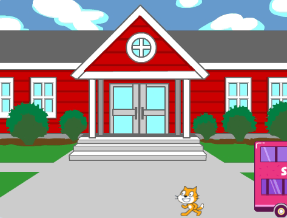
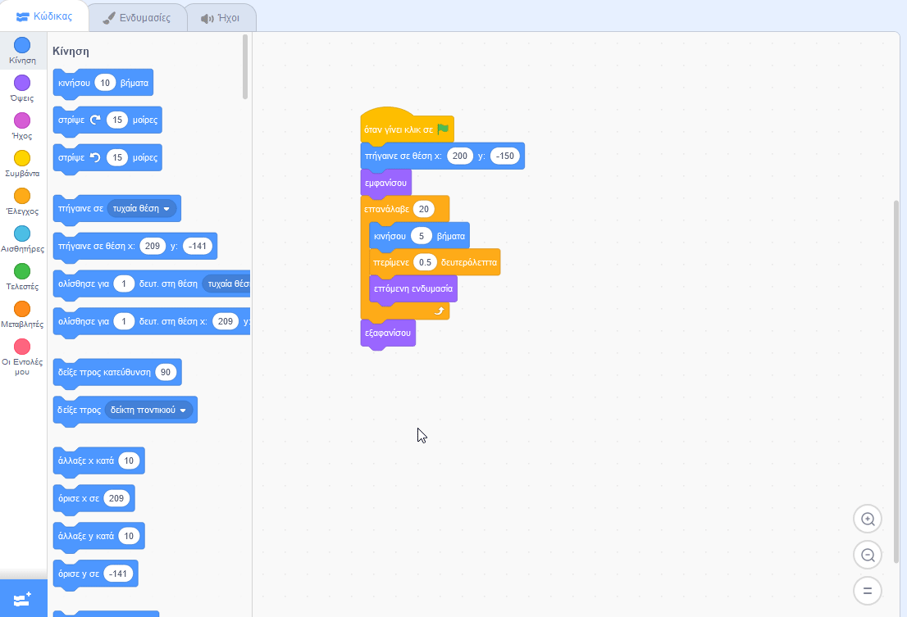

## Χάνοντας το λεωφορείο

<div style="display: flex; flex-wrap: wrap">
<div style="flex-basis: 200px; flex-grow: 1; margin-right: 15px;">
Τι θα γινόταν αν η γάτα του Scratch δεν έτρεχε αρκετά γρήγορα για να προλάβει το λεωφορείο;
</div>
<div>

{:width="300px"}

</div>
</div>

### Κάνε τη γάτα του Scratch να χάνει το λεωφορείο

--- task ---

Επίλεξε το αντικείμενο **Γάτα του Scratch** και πρόσθεσε ένα μπλοκ `περίμενε`{:class="block3control"}:


```blocks3
when flag clicked
go to x:(200) y:(-150) 
show
repeat (20) // δοκίμασε διαφορετικούς αριθμούς
move (5) steps 
next costume 
+ wait (1) seconds
end
hide
```
--- /task ---

--- task ---

**Δοκιμή:** Κάνε κλικ στην πράσινη σημαία. Η Γάτα του Scratch θα περπατήσει πολύ αργά και θα χάσει το λεωφορείο!

--- /task ---

### Κάνε τη γάτα του Scratch να προλαβαίνει το λεωφορείο

--- task ---

Χρειάζεσαι καθυστερήσεις μικρότερες του ενός δευτερολέπτου. Το 0,5 είναι μισό δευτερόλεπτο, το 0,25 είναι ένα τέταρτο του δευτερολέπτου και το 0,1 είναι ένα δέκατο του δευτερολέπτου.

Άλλαξε την καθυστέρηση στο μπλοκ `περίμενε`{:class="block3control"}:


```blocks3
wait (0.2) seconds // δοκίμασε 0.1, 0.5, 0.05
```

**Δοκιμή:** Κάνε κλικ στην πράσινη σημαία και η γάτα του Scratch θα περπατήσει πιο γρήγορα. Επίλεξε την καθυστέρηση που σου αρέσει περισσότερο.

--- /task ---

### Επίλεξε αν η γάτα του Scratch θα προλάβει ή θα χάσει το λεωφορείο

--- task ---

Εάν θέλεις η γάτα του Scratch να **χάσει το λεωφορείο**, αφαίρεσε το μπλοκ `εξαφανίσου`{:class="block3looks"} από τον κώδικά σου, έτσι ώστε η γάτα του Scratch να παραμείνει στο Σκηνικό:




```blocks3
when flag clicked
go to x:(200) y:(-150) 
show
repeat (20) 
move (5) steps 
next costume
wait (0.5) seconds 
end
-hide
```
--- /task ---

--- task ---

Εάν θέλεις η γάτα του Scratch να **προλάβει το λεωφορείο**, κάνε το λεωφορείο να περιμένει περισσότερο πριν φύγει:


```blocks3
when flag clicked 
+wait [4] seconds // αλλαγή από 4 σε 6
glide [2] secs to x: [320] y: [-100] // δεξιά πλευρά της Σκηνής
hide
```

Θα χρειαστεί να επαναφέρεις το μπλοκ `εξαφανίσου`{:class="block3looks"} στον κώδικα του αντικειμένου γάτα του Scratch **Cat**, εάν το έχεις αφαιρέσει και θέλεις η γάτα του Scratch να προλάβει το λεωφορείο.

--- /task ---

--- task ---

Κάνε αλλαγές έως ότου η κινούμενη εικόνα λειτουργεί όπως θέλεις.

--- /task ---

<p style="border-left: solid; border-width:10px; border-color: #0faeb0; background-color: aliceblue; padding: 10px;">
Όταν εργάζεσαι σε ένα έργο, συχνά επιστρέφεις και αλλάζεις ή βελτιώνεις τον κώδικά σου καθώς σου έρχονται νέες ιδέες. 
</p>


