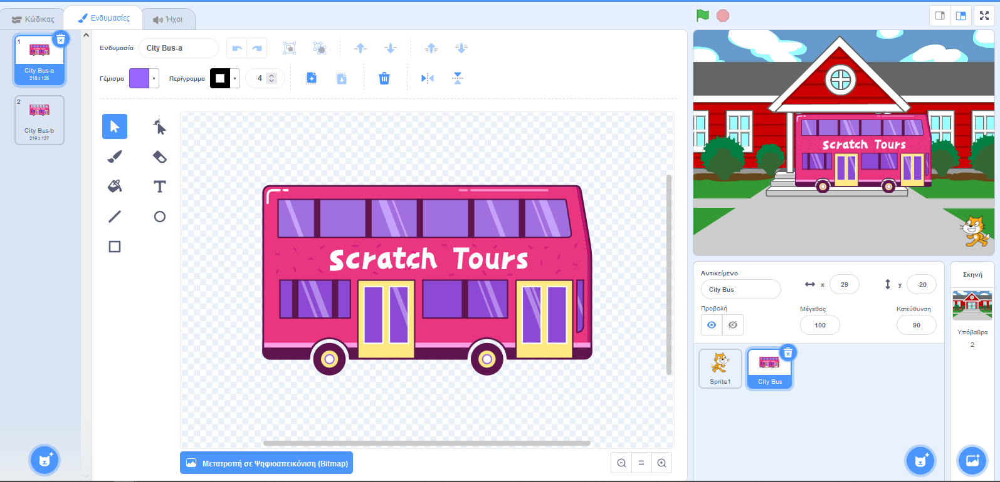
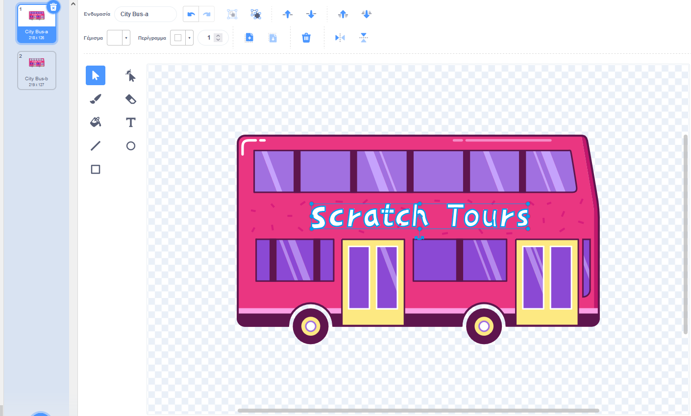
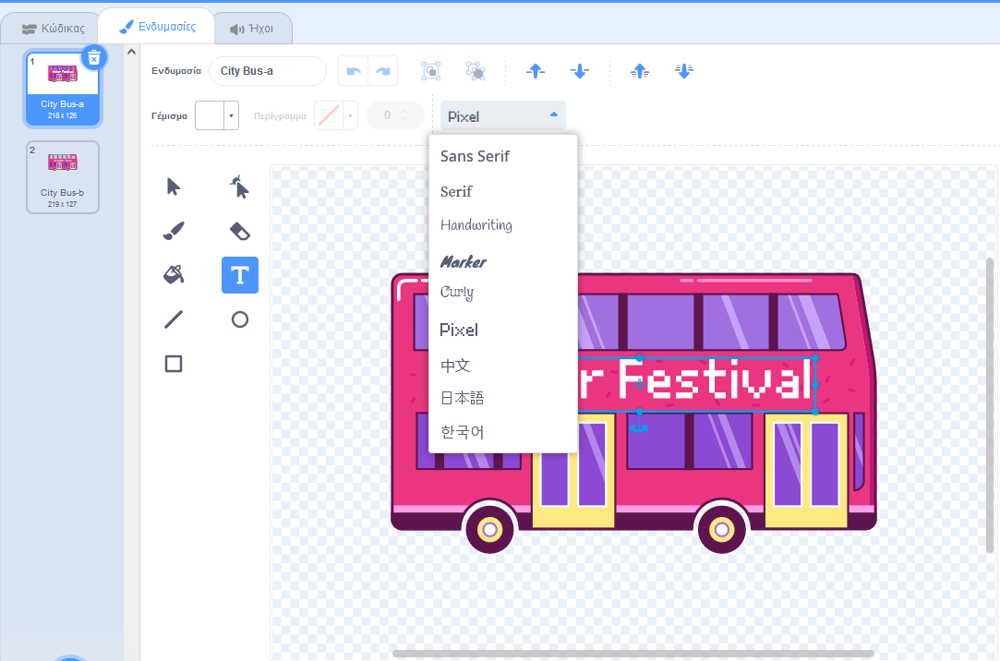
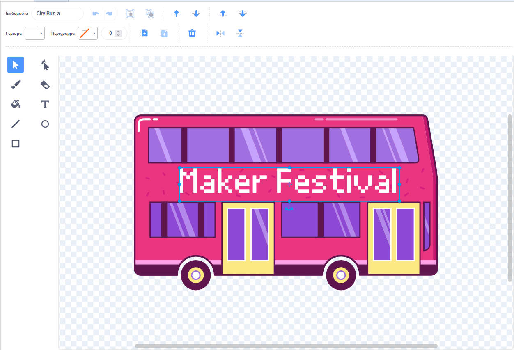

## Άλλαξε τον προορισμό

Η γραφή στο λεωφορείο λέει "Scratch Tours", αλλά μπορείς να αλλάξεις τον προορισμό σε κάποιον της επιλογής σου. Πού θέλεις να πάει το λεωφορείο σου;  

{:width="300px"}

--- task ---

Επίλεξε το αντικείμενο **Αστικό Λεωφορείο** και κάνε κλικ στην καρτέλα **Ενδυμασίες**:

--- /task ---

--- task ---

Κάνε κλικ στο λευκό κείμενο "Scratch Tours" για να το επιλέξεις και, στη συνέχεια, κάνε κλικ στο **Διαγραφή** για να το αφαιρέσεις.

--- /task ---

**Συμβουλή:** Μπορείς να χρησιμοποιήσεις το κουμπί **Διαγραφή** στο πρόγραμμα ζωγραφικής ή το <kbd>Delete</kbd> στο πληκτρολόγιό σου.

--- task ---

Επίλεξε το εργαλείο **Κειμένου**.

Κάνε κλικ στο λεωφορείο στο σημείο από το οποίο θέλεις να ξεκινάει το κείμενό σου και πληκτρολόγησε τον προορισμό της επιλογής σου.

Για να αλλάξεις τη γραμματοσειρά (ύφος γραφής), μπορείς να κάνεις κλικ στο αναπτυσσόμενο μενού **Γραμματοσειρά**:

--- /task ---

--- task ---

Κάνε κλικ στο **Επιλογή** (βέλος) και, στη συνέχεια, σύρε το κείμενο για να το τοποθετήσεις στο λεωφορείο.

--- /task ---

--- save ---
