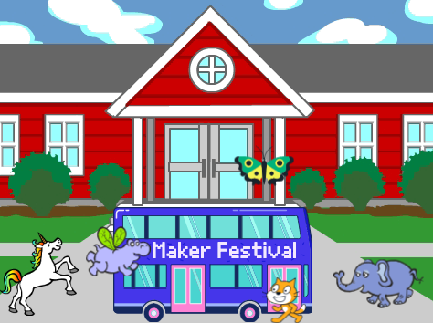

## Αναβάθμισε το έργο σου

Τώρα, μπορείς να προσθέσεις ένα αντικείμενο της επιλογής σου στο κινούμενο σχέδιο σου. Θα χρειαστεί να προσθέσεις κώδικα για να κάνεις το αντικείμενο να `πάει στην`{:class="block3motion"} αρχική θέση, `να δείξει`{:class="block3motion"} προς τη σωστή κατεύθυνση και μετά `να επαναλάβει`{:class ="block3control"} `κινηθεί`{:class="block3motion"} και να αλλάξει στο `επόμενο κοστούμι`{:class="block3looks"} για να φτάσει στο λεωφορείο.

**Συμβουλή:** Όταν κάνεις κλικ στο **Επιλέξτε ένα Αντικείμενο**, μπορείς να κρατήσεις τον δείκτη του ποντικιού πάνω από ένα αντικείμενο για να δεις τις ενδυμασίες του ή σε ορισμένες κινητές συσκευές, μπορείς να πατήσεις παρατεταμένα σε ένα αντικείμενο για να δεις τις ενδυμασίες του (αν υπάρχει παράθυρο εμφανίζεται όταν πατάς παρατεταμένα ένα αντικείμενο, πάτησε στο πλάι της οθόνης για να κλείσεις το παράθυρο και να δεις τις ενδυμασίες). Κοιτάζοντας τις ενδυμασίες των αντικείμενων μπορεί να σε βοηθήσει να βρεις ένα αντικείμενο που λειτουργεί καλά για κινούμενη εικόνα.

{:width="300px"}

Μπορείς να χρησιμοποιήσεις οποιοδήποτε από τα μπλοκ που έμαθες σε αυτό το έργο, καθώς και αυτά που γνωρίζεις ήδη:

```blocks3
when flag clicked

when [timer v] > [5]

go to x: [0] y: [0] // drag the sprite to choose x and y

show

hide

glide [2] secs to x: [0] y: [-100] // bottom middle of the Stage

repeat [30]
end

point towards (City Bus v)

point in direction (180) // point down

set rotation style [left-right v]

move [3] steps

next costume

start sound [clown honk v]

wait [0.1] seconds // short delay

set [color v] effect to [50] // up to 200
```

--- collapse ---
---
title: Ολοκληρωμένο έργο
---

Μπορείς να δεις [ολοκληρωμένο το έργο εδώ](https://scratch.mit.edu/projects/486719199/){:target="_blank"}.

--- /collapse ---

Μπορείς επίσης να «αναμίξεις» το έργο για να κάνεις όποιες αλλαγές σου αρέσουν. Θα μπορούσες να προσθέσεις ηχητικά εφέ στο λεωφορείο ή άλλα αντικείμενα ή να ορίσεις το χρωματικό εφέ του λεωφορείου. Ένα από τα αντικείμενα θα μπορούσε να χάσει το λεωφορείο και να μην κρυφτεί.

Ευχαριστούμε την ψηφιακή maker Lyla για την αποστολή αυτής της φανταστικής αναβάθμισης!


--- save ---
