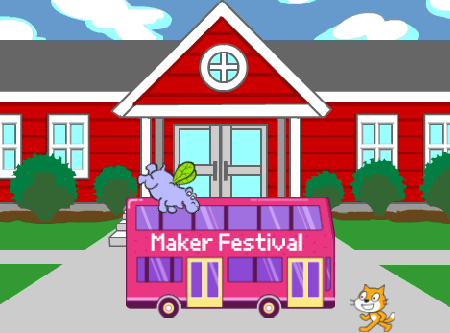

## Introduction

You will create an animation where sprites catch a bus.

You will:
+ Make sprites do different things `when green flag clicked`{:class="events"}
+ Position sprites on the **stage**
+ Use a `repeat`{:class="events"} loop to `Move`{:class="motion"} sprites and `switch costumes`{:class="looks"}

--- no-print ---
--- task ---
### Try it

  

Click the green flag to watch the animation. Which sprites change their costumes to create an animation effect?

  <iframe allowtransparency="true" width="485" height="402" src="https://scratch.mit.edu/projects/embed/486719199/?autostart=false" frameborder="0"></iframe>

--- /task ---
--- /no-print ---

--- print-only ---

--- /print-only ---

**Did you know?** **woodcut animation** was the first form of printmaking in the 1400s. Woodcut artisans would carve each part of the animation out of wood blocks, and roll them over with paint, like stamps, to make prints. When the images were put together in a book, an animation would be made!

