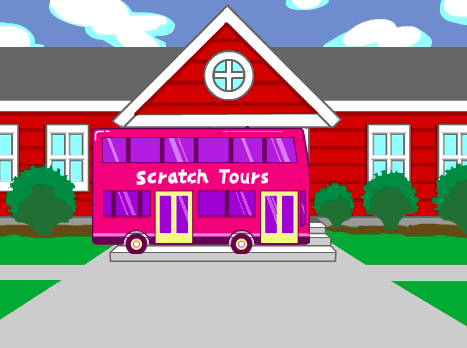
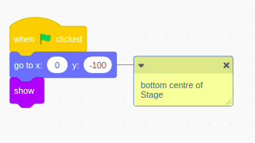

## Create your bus scene

Create your scene and add a bus.

--- task ---

Open a [new Scratch project](http://rpf.io/scratch-new){:target="_blank"}. Scratch will open in another browser tab.

--- collapse ---
---
title: Working offline
---
To set up Scratch for offline use visit [our Scratch guide](https://learning-admin.raspberrypi.org/en/projects/getting-started-scratch/1){:target="_blank"}.
--- /collapse ---

--- /task ---

Add a backdrop to change the look of your Stage. We have chosen a school scene, but you can choose whatever backdrop you like.

--- task ---

Click (or tap) on **Choose a Backdrop** from the Stage pane:

--- /task ---

--- task ---

Click on the **Outdoors** category for a school scene.

--- /task ---

Add your bus to the scene.

--- task ---

Click on **Choose a Sprite** from the Sprite list.

--- /task ---

--- task ---

Scroll down and click on the **City Bus** sprite to add it to your project.

--- /task ---

Position your bus so that it is ready to go

--- task ---

Drag a `when this sprite clicked`{:class="block3events"} block from the `Events`{:class="block3events"} block menu. Make sure you are in the **Scratch Tour Bus** sprite.

--- /task ---

--- task ---

`Drag a 'go to x: () y: ()``{:class="block3motion"} block from the `Motion`{:class="block3motion"} block menu, and place it under your first code block.

--- /task ---

Oh no, our bus is not parked in a good spot!

The 'go to x: () y: ()``{:class="block3motion"} block you just added gets a sprite to go to a certain place on the Stage. In Scratch, the coordinates change in the **Blocks menu** until you drag the code block into the **Code area**.

GIF?

To make sure the bus is parked in a better spot, we need to change the numbers in the 'go to x: () y: ()``{:class="block3motion"} block.

--- task ---

Change x to 0 and y to -100

