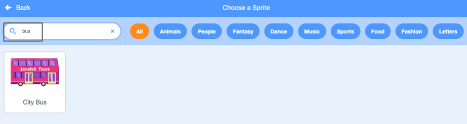

## Create your bus scene

You will choose a backdrop and add a bus sprite.

--- task ---

Open a [new Scratch project](http://rpf.io/scratch-new){:target="_blank"}. Scratch will open in another browser tab.

--- collapse ---
---
title: Working offline
---
To set up Scratch for offline use visit [our Scratch guide](https://learning-admin.raspberrypi.org/en/projects/getting-started-scratch/1){:target="_blank"}.
--- /collapse ---

--- /task ---

--- task ---

Click (or tap) on **Choose a Backdrop** from the Stage pane:


--- /task ---

--- task ---

Click the **Outdoors** category. Add a backdrop that makes a good starting point for your bus. 


--- /task ---

--- task ---

Click on 'Choose a sprite'. 


--- /task ---

--- task ---

Type 'bus' in the search box at the top:



Add the **City Bus** sprite to your project.

--- /task ---

 In Scratch you run projects by clicking on the green flag above the stage. Your bus needs to be in its start position `when green flag clicked`{:class="block3events"}.

--- task ---
Make sure the **City Bus** sprite is selected in the Sprite list below the Stage.

Drag a `when green flag clicked`{:class="block3events"} block from the `Events`{:class="block3events"} Blocks menu to the Code area. 


```blocks3
when flag clicked
```

--- /task ---

--- task ---

Drag the bus to a good position on the stage:


The x and y coordinates of the bus show in the Sprite pane below the Stage:


--- /task ---

--- task ---
Add a `go to x: () y: ()`{:class="block3motion"} block:


```blocks3
when flag clicked
+go to x: (0) y: (-100)
```

The numbers in the `go to x: () y: ()`{:class="block3motion"} are the current x and y coordinates of the bus. Your numbers might be slightly different. 

--- /task ---

--- task ---

**Test:** Drag the bus to anywhere on the Stage and then click the green flag. The bus should always go to its starting position.

--- /task ---

When you drag the bus it goes in front of the cat. 

--- task ---

To make sure the **City Bus** sprite is always behind all the character sprites, add a `go to [front v] layer`{:class="block3looks"} block. Click on `front`{:class="block3looks"} and change it to `back`{:class="block3looks"}.


```blocks3
when flag clicked
go to x: (0) y: (-100)
+ go to [back v] layer
```

**Tip:** If you can't see the `go to [front v] layer`{:class="block3looks"} block you will need to scroll down in the `Looks`{:class="block3looks"} Blocks menu.

--- /task ---

--- task ---
If you want to change the colour of the bus you can:


```blocks3
when flag clicked
go to x: (0) y: (-100)
go to [back v] layer
+set [color v] effect to (50) // Try numbers up to 200
```

--- /task ---

--- task ---

The Scratch cat appears in all new Scratch projects as **Sprite1** in the Sprite list. Click on the **Sprite1** sprite to get ready to animate Scratch cat.


**Tip:** If you have accidently deleted Scratch cat you can click on the **Choose a Sprite** button and search for 'cat'. 

--- /task ---

At the moment Scratch cat is far too big to fit on the bus. 

--- task ---

From the Sprite pane, click in the **Size** property and change the size to `50`


--- /task --- 

--- save ---

