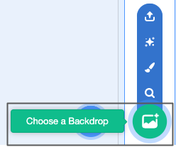

## Create your bus

Add an introductory sentence. What will learners achieve by the end of this step?

--- task ---

Open a [new Scratch project](http://rpf.io/scratch-new){:target="_blank"}. Scratch will open in another browser tab.

--- collapse ---
---
title: Working offline
---
To set up Scratch for offline use visit [our Scratch guide](https://learning-admin.raspberrypi.org/en/projects/getting-started-scratch/1){:target="_blank"}.
--- /collapse ---
--- /task ---

The **Stage** is where your project runs. A backdrop changes the way the stage looks.

--- task ---

Click (or tap) on **Choose a Backdrop** from the Stage pane:

--- /task ---

--- task ---
