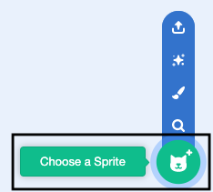
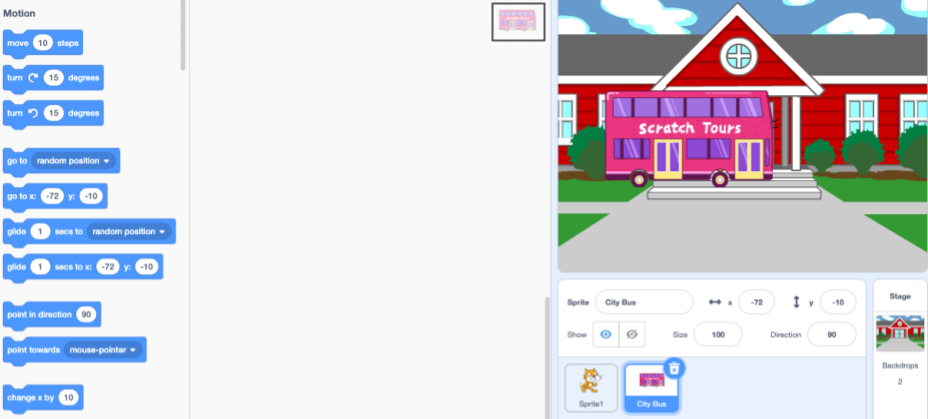

## Create your bus scene

You will choose a backdrop and add a bus sprite.

--- task ---

Open a [new Scratch project](http://rpf.io/scratch-new){:target="_blank"}. Scratch will open in another browser tab.

--- collapse ---
---
title: Working offline
---
To set up Scratch for offline use visit [our Scratch guide](https://learning-admin.raspberrypi.org/en/projects/getting-started-scratch/1){:target="_blank"}.
--- /collapse ---

--- /task ---

--- task ---

Click (or tap) on **Choose a Backdrop** from the Stage pane:


--- /task ---

--- task ---

Click  the **Outdoors** category. Find a backdrop that makes a good starting point for a bus tour. We chose the School backdrop. Where will your characters start their journey?

Click on the backdrop to add it to your project: 


--- /task ---

--- task ---

Click on 'Choose a sprite'. 



--- /task ---

--- task ---

Type 'bus' in the search box at the top:


Add the **City Bus** sprite to your project.

--- /task ---

You want the bus to be in its start position when you run your project. To do this you use a `when green flag clicked`{:class="block3events"} block which runs the blocks underneath it when you click on the green flag above the stage.

--- task ---
Make sure the **Scratch Tour Bus** sprite is selected in the Sprite list below the Stage.

Drag a `when green flag clicked`{:class="block3events"} block from the `Events`{:class="block3events"} Blocks menu to the Code area. 


```blocks3
when flag clicked
```

**Tip:** The image in the top right of the Code area shows which sprite you are adding code to.



--- /task ---

Oh no, our bus is not parked in a good spot!


--- task ---

Drag the bus to a good position in the middle of the stage at the bottom:


The x and y coordinates of the bus show in the Sprite pane below the Stage:


--- /task ---

--- task ---
Drag a `go to x: () y: ()`{:class="block3motion"} block from the `Motion`{:class="block3motion"} block menu, and place it under your first code block.

Your code should look like this:


```blocks3
when flag clicked
+go to x: (0) y: (-100)
```

The numbers in the `go to x: () y: ()`{:class="block3motion"} are the current x and y coordinates of the bus. Your numbers might be slightly different. 

--- /task ---

--- task ---

**Test:** Drag the bus to anywhere on the Stage and then click the green flag. The bus should always go to its starting position at the bottom middle of the Stage.

--- /task ---

--- task ---
If you want to change the colour of the bus you can:


```blocks3
when flag clicked
go to x: (0) y: (-100)
+set [color v] effect to (50) // Try numbers up to 200
```

--- /task ---

--- task ---

The Scratch cat appears in all new Scratch projects as **Sprite1** in the Sprite list. Click on the **Sprite1** sprite to get ready to animate Scratch cat.


**Tip:** If you have accidently deleted Scratch cat you can click on the **Choose a Sprite** button and search for 'Cat'. 

--- /task ---

At the moment Scratch cat is far too big to fit on the bus. 

--- task ---

From the Sprite pane, click in the **Size** property and change the size to `50`


--- /task --- 

You will get Scratch cat to appear on the right of the Stage then walk to the bus. 

--- task ---

Click in the **Direction** property and rotate the arrow to point to `-90`. Click on the middle arrow icon to change the rotation style to `left-right`.


--- /task ---

--- save ---

