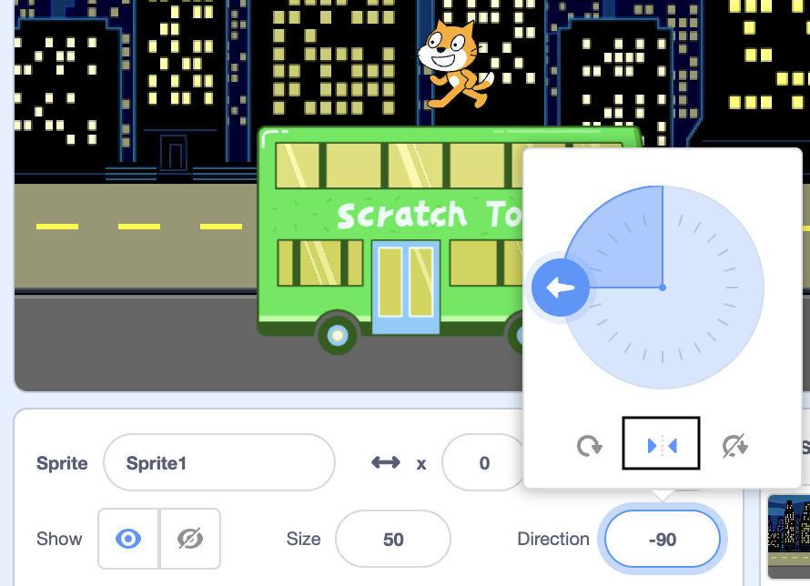
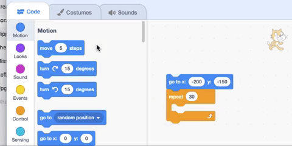

## Scratch Cat catches the bus

You will animate the Scratch cat to appear on the **right** of the Stage and walk to the bus by repeating a small movement many times in a **loop**. 


### Get Scratch cat into the start position

--- task ---

Click in the **Direction** property and rotate the arrow to point to `-90`. 

Click on the middle arrow icon to change the rotation style to `left-right` to stop Scratch cat turning upside down.



--- /task ---


--- task ---

Drag Scratch cat to the bottom right edge of the Stage.

**Tip:** If you try to position a sprite off Stage it will move back to its last Stage position. 

--- /task ---

--- task ---

Add code to get your cat to the starting position:


```blocks3
when flag clicked
go to x:(200) y:(-150) // bottom right
```

--- /task ---

--- task ---

**Test:** Drag Scratch cat to a new position then click on your `go to x: y:`{:class="block3motion"} block. Scratch cat should move back to the bottom right each time.

--- /task ---

### Animate Scratch cat

To animate Scratch cat you will add code to repeat a small amount of steps many times in a loop. 

--- task ---

Add a `repeat 10`{:class="block3control"} block then drag a `move 10 steps`{:class="block3motion"} block inside it: 




```blocks3
when flag clicked
go to x:(200) y:(-150) // bottom right
+ repeat (10) // try different numbers
move (5) steps //  5 is a good walking speed
end
```

--- /task ---

--- task ---

**Test:** Click the green flag. Try changing the numbers so Scratch cat stops at the bus.

--- /task ---

Some sprites have more than one costume. You will use Scratch cat's costumes to create a walking animation.   

--- task ---

Click on the Costumes tab. Scratch cat has two costumes and together they can be used to make a walking movement. 

--- /task ---

--- task ---

Click back to the Code tab. Add a `next costume`{:class="block3looks"} block:


```blocks3
when flag clicked
go to x:(200) y:(-150) // bottom right
repeat (20) // try different numbers
move (5) steps //  5 is a good walking speed
+ next costume 
end
```
--- /task ---

--- task ---

**Test:** Click the green flag to see the Scratch walk to the bus. 

--- /task ---

Now we want Scratch cat to enter the bus. You will get Scratch cat to `hide`{:class="block3looks"} to look like they enter the bus.

--- task ---

Add a block to `hide`{:class="block3looks"} Scratch cat when it reaches to the bus:


```blocks3
when flag clicked
go to x:(200) y:(-150) // bottom right
repeat (20) // try different numbers
move (5) steps //  5 is a good walking speed
next costume 
end
+ hide
```

--- /task ---

--- task ---

**Test:** Click the green flag again, and you will see that Scratch cat has now disappeared.

--- /task ---

To get Scratch cat back and run the animation again, you need Scratch cat to show.

--- task ---

Add a `show`{:class="block3looks"} block so Scratch cat appears before walking to the bus:


```blocks3
go to x:(200) y:(-150) // bottom right
+ show
repeat (30) // try different numbers
move (5) steps //  5 is a good walking speed
next costume 
end
hide
```

--- /task ---

--- task ---

**Test:** Click the green flag to test your project and make sure Scratch cat appears. 

--- /task ---

--- save ---
