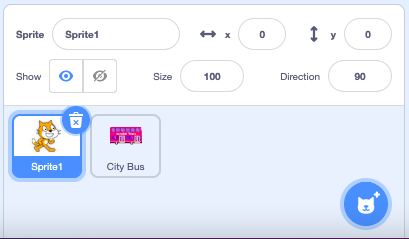
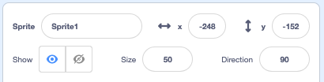

## Scratch Cat catches the bus

Sprites can be animated by repeating a small movement many times. You will use this to make Scratch cat walk to the bus. 

--- task ---

Scratch cat appears in all new Scratch projects and should still be in your Sprite list. Click on **Sprite 1** to get ready to animate Scratch cat.



**Tip:** If you have accidently deleted Scratch cat you can add it again by clicking on the **Choose a Sprite** button and searching for 'Cat'. 

--- /task ---

At the moment Scratch cat is far to big to fit on the bus. 

--- task ---

From the Sprite pane, click in the **Size** property and change the size to `50`



--- /task ---

Scratch cat will appear on the left of the Stage and walk to the bus.  

--- task ---

Drag Scratch cat to it's starting position in the bottom left of the Stage.

**Tip** If you try to position a sprite off Stage it will move back to it's last Stage position. Try to get Scratch cat as close to the edge as you can without it being completely off Stage.

--- /task ---

--- task ---

Drag a `go to x: y:`{:class="block3motion"} block to the Code area. 


```blocks3
go to x:(-200) y:(-150) // bottom left
```

Test it by dragging Scratch cat to a new position then click on your go to x: y:`{:class="block3motion"} block. Scratch cat should move back to the bottom left each time.

--- /task ---

To animate Scratch cat you will add code to repeat a small amount of steps many times. 

--- task ---

From the Control Blocks menu add a repeat 10 block then from the Motion Blocks menu drag a move 10 steps block inside it. Click on your code to test it, change the numbers to make Scratch cat walk to the bus.


```blocks3
go to x:(-200) y:(-150) // bottom left
+ repeat (30) // try different numbers
move (5) steps //  5 is a good walking speed
end
```

--- /task ---

Some sprites have more than one costume, you will use Scratch cat's costumes to create a walking animation.   

--- task ---

Click on the Costumes tab. Scratch cat has two costumes and together they can be used to make a walking movement. 

--- /task ---

--- task ---

Click back to the Code tab. Add a next costume block and click on your code to test it:


```blocks3
go to x:(-200) y:(-150) // bottom left
repeat (30) // try different numbers
move (5) steps //  5 is a good walking speed
+ next costume 
end
```

--- /task ---

Scratch cat currently stops when it reaches the bus. Sprites can hide and show themselves so they are not always visible on the Stage.  

--- task ---

Add a hide block to Scratch cat when it reaches to the bus:


```blocks3
go to x:(-200) y:(-150) // bottom left
repeat (30) // try different numbers
move (5) steps //  5 is a good walking speed
next costume 
end
+ hide
```

--- /task ---

--- task ---

Click on your code again, Scratch cat is now hidden all the time. Add a show block so Scratch cat appears before walking to the bus:


```blocks3
go to x:(-200) y:(-150) // bottom left
+ show
repeat (30) // try different numbers
move (5) steps //  5 is a good walking speed
next costume 
end
hide
```

--- /task ---

You can control when sprites run their animation code. Animators often use a timer to wait a certain number of seconds before the code runs. This enables them to control many different sprites in one animatied project. 

--- task ---

From the Events Blocks menu drag a 'when loudness > 10' and connect it to the top of your code. Click on 'loudness' to change it to 'timer' and change the wait time to '3' seconds.


```blocks3
+ when [timer v] > (3) // wait 3 seconds
go to x:(-200) y:(-150) // bottom left
show
repeat (30) // try different numbers
move (5) steps //  5 is a good walking speed
next costume 
end
hide
```

--- /task ---

--- save ---
