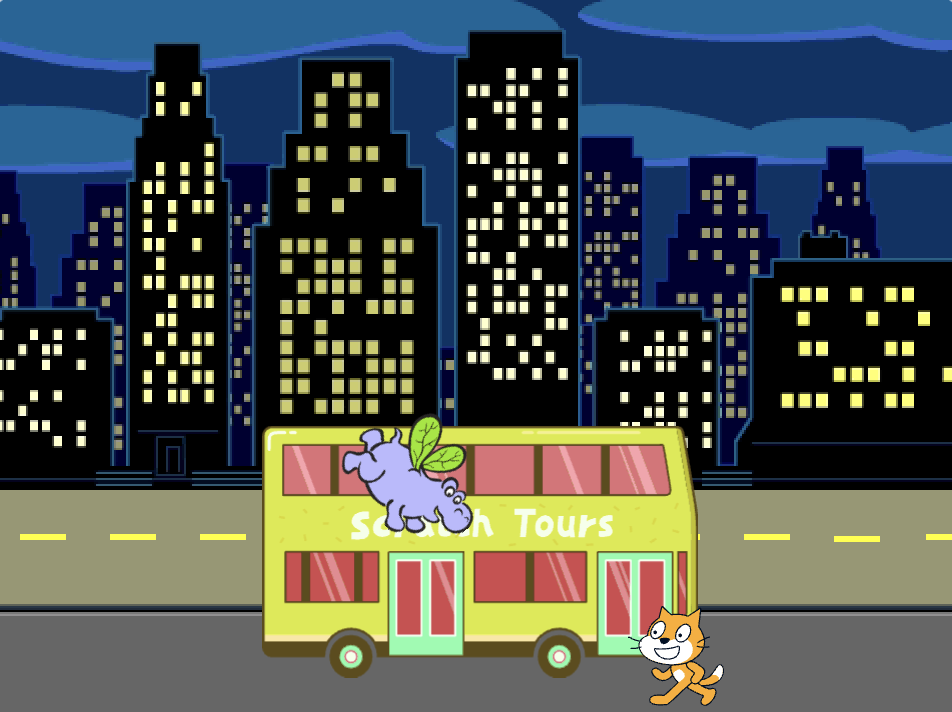
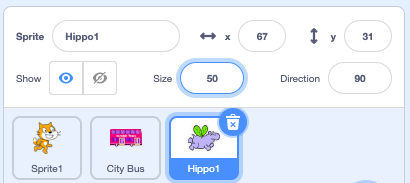
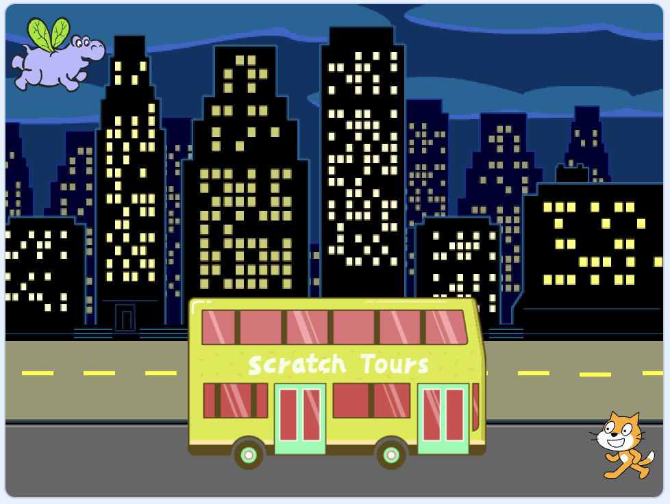

## The hippo flies to the bus

You will add a hippo sprite that flies to the bus.

{:width="300px"}

The **Hippo1** sprite has two costumes with wings in different positions, so it can be animated to fly to the bus.

--- task ---

Add the **Hippo1** sprite to your project. 

Change the **Size** of the **Hippo1** sprite:



--- /task ---

--- task ---
Drag the hippo to the top left-hand side of the Stage:



--- /task ---

--- task ---

Add code to get the hippo to its starting position:

```blocks3
when flag clicked
go to x: [-200] y: [150] // top left
```

**Tip:** The `x`{:class="block3motion"} and `y`{:class="block3motion"} coordinates in the `go to x: y:`{:class="block3motion"} block will be the current position of the hippo, so you do not need to type them in.

--- /task ---

The hippo will fly towards the bus, flapping its wings. 

The hippo will `point towards`{:class="block3motion"} the bus before moving.

--- task ---

Add code to make the hippo fly towards the **City Bus**:

```blocks3
when flag clicked
go to x: [-200] y: [150] 
+repeat [100] 
point towards (City Bus v) // change from mouse-pointer
move [3] steps
next costume
+end
```

--- /task ---

--- task ---
**Test:** Click on the green flag to see the hippo fly to the bus. You can change the number of repeats to get the hippo to stop in just the right place. 
--- /task ---

Now, the hippo will enter the bus.

--- task ---

Add `show`{:class="block3looks"} and `hide`{:class="block3looks"} blocks:

```blocks3
when flag clicked
go to x: [-200] y: [150] 
+ show
repeat [90] 
point towards (City Bus v)
move [3] steps
next costume
end
+ hide
```

**Tip:** When you use a `hide`{:class="block3looks"} block, you need to also add a `show`{:class="block3looks"} block to make sure that the sprite is visible when it needs to be.

--- /task ---

--- task ---
**Test:** Click on the green flag to see the hippo fly and enter the bus. 
--- /task ---

--- save ---
