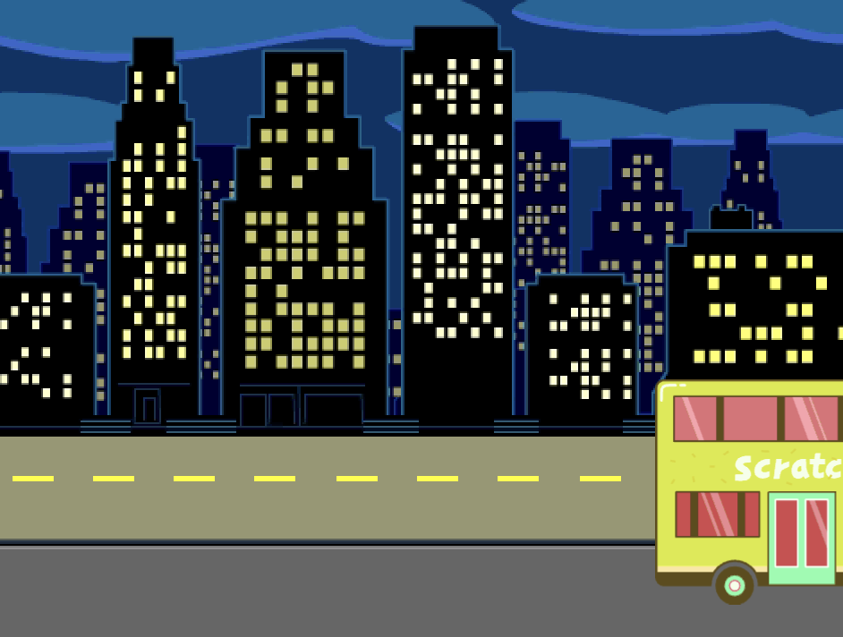

## The bus leaves

A group of connected blocks in Scratch is called a **script**. You will add a new script to make the bus drive off.

{:width="300px"}

The bus will drive off to the right five seconds after the green flag is clicked. The `when [timer v]`{:class="block3events"} block runs the blocks below it after this time delay.

--- task ---

Select the bus sprite.


--- /task ---

--- task ---

From the `Events`{:class="block3events"} Blocks menu drag a `when [loudness v]`{:class="block3events"} block to the Code area. Change `loudness`{:class="block3events"} to `timer`{:class="block3events"}. This will start a new script:


```blocks3
when [timer v] > [4] 
```

--- /task ---

--- task ---

Drag your bus to the right of the stage. This will be the x and y position the bus will `glide to`{:class="block3motion"}.


**Tip:** If you move the bus too far to the right then it will jump back. Try again and don't move it quite so far.

--- /task ---

--- task ---
Add a `glide`{:class="block3motion"} block under your `when [timer]`{:class="block3events"} block. 

Your x and y coordinates might be slightly different::


```blocks3
when [timer v] > [4] 
+glide [2] secs to x: [320] y: [-100] // right of Stage
```

--- /task ---

--- task ---
**Test:** Click the green flag. The cat and hippo sprites will move to the bus and the bus will drive off to the right after 5 seconds. 
--- /task ---

--- task ---
Add a `hide`{:class="block3looks"} block to make the bus look like it drives off the Stage:


```blocks3
when [timer v] > [4] 
glide [2] secs to x: [320] y: [-100]
+ hide
```
--- /task ---

--- task ---
**Test:** Click the green flag. The bus will now hide after driving off. Do you remember how to make sure a sprite reappears when you click the green flag?
--- /task ---

--- task ---
Add a `show`{:class="block3looks"} block to your when green flag is clicked script to make the bus appear when you run your project:


```blocks3
when flag clicked
go to x: [0] y: [-100] 
+show
```

--- /task ---

--- task ---
**Test:** Click the green flag and watch your animation. The bus should appear in the centre of the screen and then drive off to the right and disappear. 

Is everyone on the bus when it leaves? You can change the amount of time the bus waits if you need to.
--- /task ---

--- save ---
