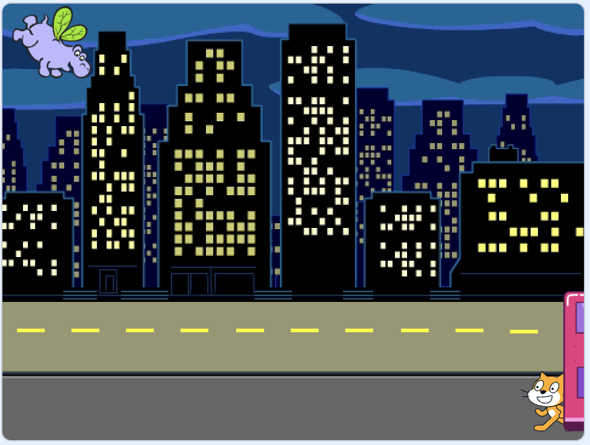

## The bus leaves

Now it's time to add code to make the bus drive off to the right of the Stage. 

The bus doesn't need to change costume so you can use a `glide`{:class="block3motion"} block to make it move gradually to a new position.

--- task ---
The `glide`{:class="block3motion"} block needs x and y positions to glide to. To set these, drag your bus to the right of the Stage:



**Tip:** If you move the bus too far to the right then it will jump back. Try again and don't move it quite so far.

--- /task ---

The `glide`{:class="block3motion"} block in the `Motion`{:class="block3motion"} Blocks menu will now have the new x and y positions for the bus. 

--- task ---
Add this code to the bus sprite to make it glide to the right after 5 seconds:

```blocks3
when [TIMER v] > [5] 
glide [2] secs to x: [320] y: [-100] // right of Stage
```

Your x and y coordinates might be slightly different. 

--- /task ---

--- task ---
**Test:** Click the green flag. The cat and hippo sprites will move to the bus and the bus will drive off to the right after 5 seconds. 
--- /task ---

--- task ---
Add a `hide`{:class="block3looks"} block to make the bus look like it drives off the Stage:

```blocks3
when [TIMER v] > [5] 
glide [2] secs to x: [320] y: [-100]
+ hide
```
--- /task ---

--- task ---
**Test:** Click the green flag. The bus will now hide after driving off. If you click the green flag again you won't be able to see the bus because it's still hidden! 
--- /task ---

--- task ---
Add a `show`{:class="block3looks"} block to make the bus appear when the green flag is clicked:

```blocks3
when flag clicked
go to x: [0] y: [-100] 
+show
```

--- /task ---

--- task ---
**Test:** Click the green flag and watch your animation. The bus should appear in the centre of the screen and then drive off to the right and disappear. 
--- /task ---

--- save ---
