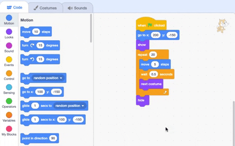

## Missing the bus

What if Scratch cat didn't run fast enough to catch the bus?

{:width="300px"}

--- task ---
Select the cat sprite and add a `wait`{:class="block3control"} block:


```blocks3
when flag clicked
go to x:(-200) y:(-150) 
show
repeat (20) // try different numbers
move (5) steps 
next costume 
+ wait (1) seconds
end
hide
```
--- /task ---

--- task ---
**Test:** Click the green flag to see Scratch walk too slowly and miss the bus!

--- /task ---

You will want delays of less than one second. 0.5 is half a second. 0.25 is a quarter of a second and 0.1 is a tenth of a second. 

--- task ---

Change the delay in the `wait`{:class="block3control"} block:


```blocks3
wait (0.2) seconds // Try 0.1, 0.5, 0.05
```

**Choose:** Click the green flag to see Scratch walk faster. Choose the delay that you like best.

--- /task ---

**Choose:** Choose if you want Scratch to **miss the bus** or **catch the bus**.

--- task ---

If you want Scratch cat to **miss the bus**, remove the `hide`{:class="block3looks"} block from your code so that Scratch cat stays on the Stage:




```blocks3
when flag clicked
go to x:(-200) y:(-150) 
show
repeat (20) 
move (5) steps 
next costume
wait (0.5) seconds 
end
-hide
```
--- /task ---

--- task ---
If you want Scratch to **catch the bus**, make the bus wait longer before leaving:


```blocks3
+when [timer v] > [6] // change from 4 to 6
glide [2] secs to x: [320] y: [-100] // right of Stage
```

You'll need to put the `hide`{:class="block3looks"} block back in Scratch cat's code if you have removed it and want the cat to successfully catch the bus.

--- /task ---

--- task ---
Make changes until you get the animation to work the way you want it to.

--- /task ---

<p style="border-left: solid; border-width:10px; border-color: #0faeb0; background-color: aliceblue; padding: 10px;">
When working on a project you often go back and change or improve your code as you get new ideas. 
</p>

--- save ---


