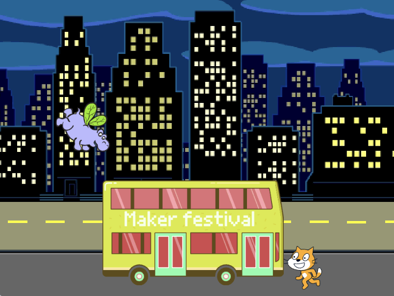
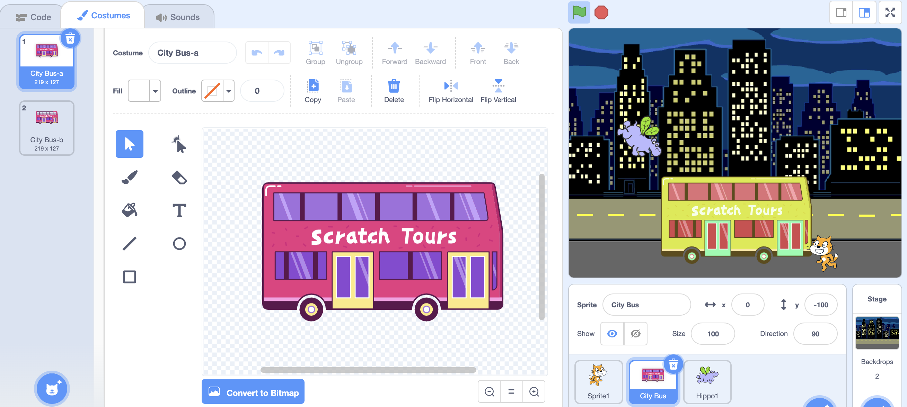
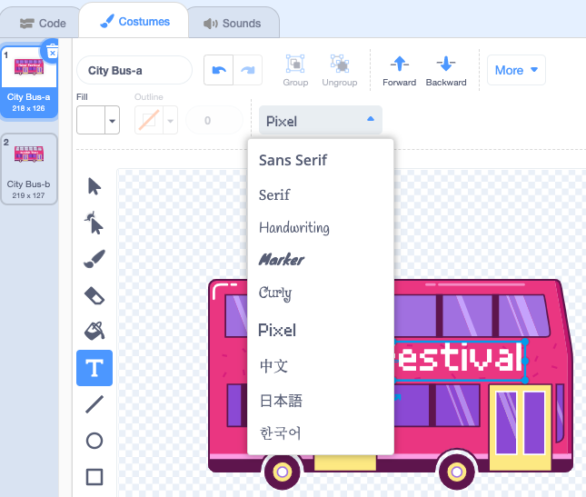

## Change the destination

The writing on the bus says "Scratch Tours" but you can change the destination to one of your choice. Where do you want your bus to go?  

{:width="300px"}

--- task ---
Select the bus sprite and click on the Costumes tab:

--- /task ---

--- task ---
Click on the white "Scratch Tours" text to select it and then click Delete to remove it:

--- /task ---

**Tip:** You can use the Delete button in the Paint editor or the Delete key on your keyboard.

--- task ---
Select the Text (writing) tool.

Click on the bus where you want your text to start and type the destination of your choice.

You can change the font (writing style) by clicking on the Font drop down:

--- /task ---

--- task ---
Click on the selection (arrow) tool and then drag the text to position it on the bus:

--- /task ---

--- save ---