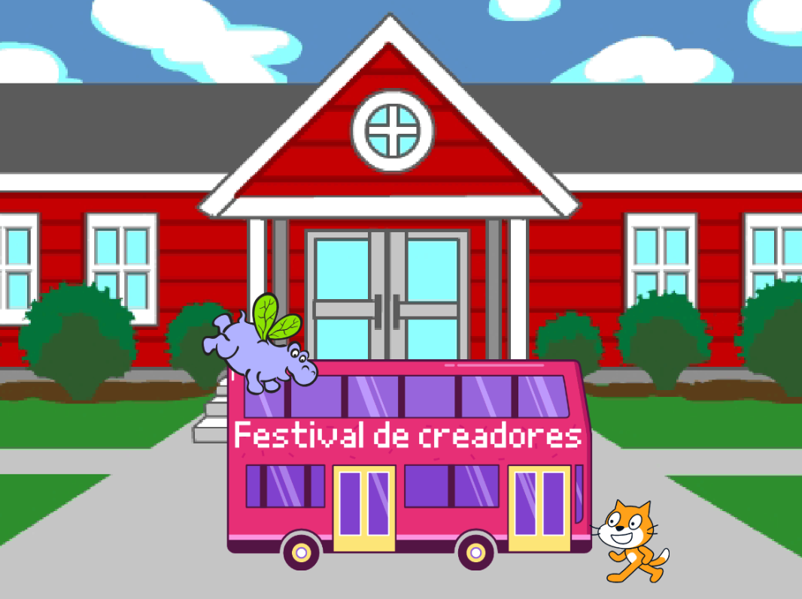

## Introducción

En este proyecto, crearás una animación con objetos que corren y vuelan para tomar el autobús.

Vas a:
+ Hacer que los objetos hagan cosas diferentes `al presionar bandera verde ⚑`{:class="block3events"}
+ Colocar los objetos en el **Escenario**
+ Utilizar un bucle de `repetición`{: class = "block3control"} para `mover`{: class = "block3motion"} los objetos y `cambiar sus disfraces`{: class = "block3looks"}

--- no-print --- --- task ---

### Pruébalo

  

Haz clic en la bandera verde para ver la animación. 

¿Qué objetos cambian sus disfraces para crear un efecto de animación?

  <iframe allowtransparency="true" width="485" height="402" src="https://scratch.mit.edu/projects/embed/486719199/?autostart=false" frameborder="0"></iframe>

--- /task --- --- /no-print ---

--- print-only ---

--- /print-only ---

** Animación ** crea el efecto de movimiento al cambiar las imágenes rápidamente. Los primeros animadores tallaron imágenes en bloques de madera y los utilizaron como sellos. ¡Es mucho más rápido usar Scratch para programar tu animación!

