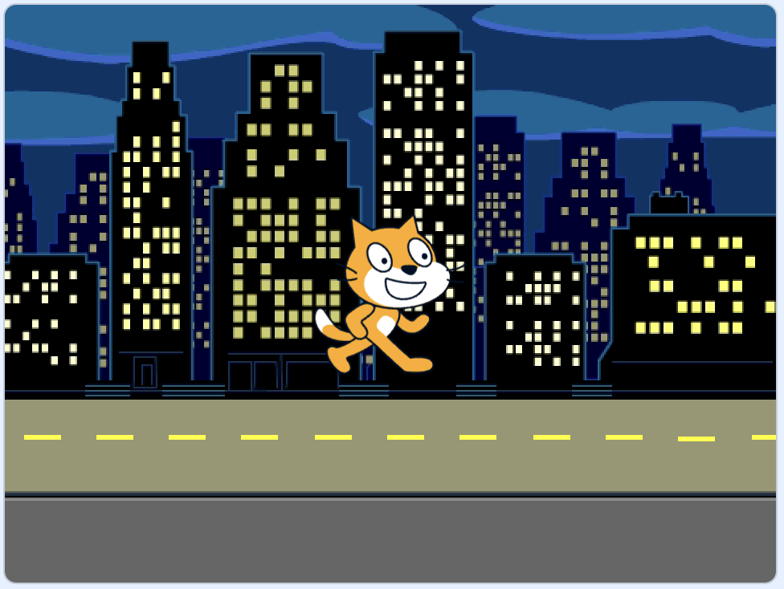

## Crea tu escena de autobús

<div style="display: flex; flex-wrap: wrap">
<div style="flex-basis: 200px; flex-grow: 1; margin-right: 15px;">
Elegirás un fondo y agregarás el objeto Autobús.
</div>
<div>

{:width="300px"}

</div>
</div>

### Abre el proyecto inicial

--- task ---

Abre el [proyecto inicial de Toma el autobús](https://scratch.mit.edu/projects/582214330/editor){:target="_blank"}. Scratch se abrirá en otra pestaña del navegador.

[[[working-offline]]]

--- /task ---

### Elige un fondo

--- task ---

Haz clic (o en una tableta, toca la pantalla) en **Elige un Fondo** en el panel Escenario (en la esquina inferior derecha de la pantalla):


--- /task ---

--- task ---

Haz clic en la categoría **Exteriores**. Agrega un fondo que sea un buen punto de partida para tu autobús:



--- /task ---

### Elige un Objeto

--- task ---

Haz clic en **Elegir un objeto**:


--- /task ---

--- task ---

Escribe `bus` en el cuadro de búsqueda en la parte superior:


Agrega el objeto **City Bus** (Autobús) a tu proyecto.

--- /task ---

### Dale a tu autobús una posición de partida

--- task ---

Asegúrate de que el objeto **City Bus** (Autobús) esté seleccionado en la lista de objetos debajo del escenario.

Arrastra un bloque `al presionar bandera verde ⚑`{:class="block3events"} desde el menú `eventos`{:class="block3events"} hacia el área de Código:


```blocks3
when flag clicked
```

--- /task ---

--- task ---

Arrastra el autobús a una buena posición en el escenario:


Las coordenadas (números utilizados para describir la posición) **x** e **y** del autobús se muestran en el panel Objetos debajo del escenario:


--- /task ---

--- task ---

Agrega un bloque `ir a x: y:`{:class="block3motion"}:


```blocks3
when flag clicked
+go to x: (0) y: (-100)
```

Los números en el bloque `ir a x: y:`{:class="block3motion"} son las coordenadas x e y actuales en las que se encuentra el autobús. Los números en tu proyecto pueden ser un poco diferentes.

--- /task ---

--- task ---

**Prueba:** Arrastra el bus a cualquier lugar del escenario y luego haz clic en la bandera verde. El bus debería regresar siempre a su posición inicial.


--- /task ---

### Mueve el autobús detrás de los objetos de los personajes

--- task ---

Para asegurarte de que el objeto **City Bus**(autobús) esté siempre detrás de todos los objetos de personajes, agrega un bloque `ir a la capa de adelante`{:class="block3looks"}, luego haz clic en `adelante`{:class="block3looks"} y cámbialo a `atrás`{:class="block3looks"}:


```blocks3
when flag clicked
go to x: (0) y: (-100)
+ go to [back v] layer
```

**Consejo:** Si no puedes ver el bloque `ir a la capa de adelante`{:class="block3looks"}, desplázate hacia abajo en el Menú `Apariencia`{:class="block3looks"}.

--- /task ---

### Cambiar el color del autobús

--- task ---

También puedes cambiar el color del autobús:


```blocks3
when flag clicked
go to x: (0) y: (-100)
go to [back v] layer
+set [color v] effect to (50) // prueba con un número hasta 200
```

--- /task ---

### Cambia el tamaño del Gato Scratch

--- task ---

El gato de Scratch aparece en todos los nuevos proyectos de Scratch como **Objeto 1** en la lista de Objetos. Haz clic en el objeto **Objeto 1** en la lista de objetos para prepararte para animar el gato de Scratch:


**Consejo:** Si has eliminado accidentalmente el objeto **Objeto 1** (Gato de Scratch), puedes hacer clic en el ícono **Elegir un objeto** y buscar `cat`.

--- /task ---

--- task ---

En el panel de objetos, haz clic en **Tamaño** y cambia el tamaño del gato de Scratch a `50`:


--- /task --- 
