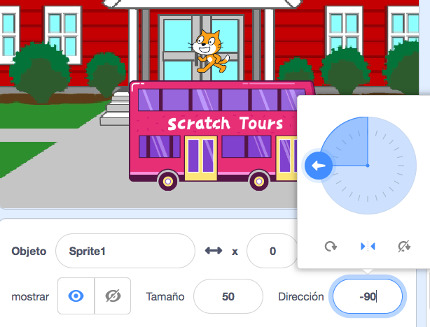
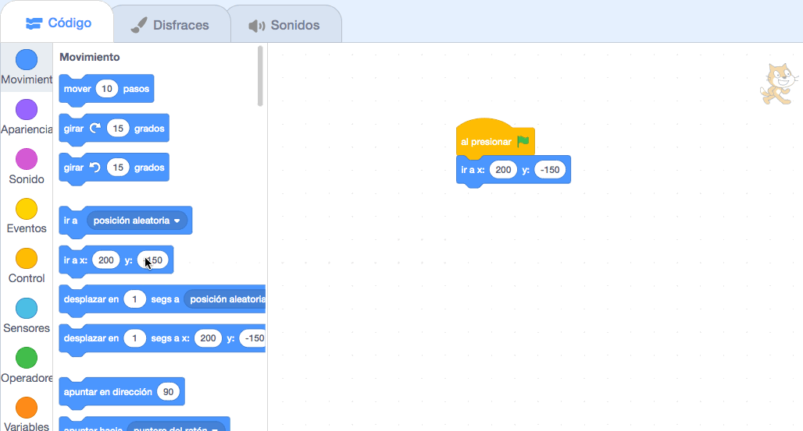

## El gato de Scratch toma el autobús

<div style="display: flex; flex-wrap: wrap">
<div style="flex-basis: 200px; flex-grow: 1; margin-right: 15px;">
Animarás al gato para que aparezca en el **lado derecho** del escenario y camine hacia el autobús repitiendo un pequeño movimiento muchas veces en un **bucle**. 
</div>
<div>

{:width="300px"}

</div>
</div>

### Coloca al Gato de Scratch en su posición inicial

--- task ---

Haz clic en **Dirección** en el panel de objetos. Gira la flecha hasta que apunte a `-90`. Luego, haz clic en el ícono que está al medio **Izquierda / Derecha** para cambiar el estilo de rotación a `izquierda-derecha` y evitar que el gato se dé la vuelta:



--- /task ---

--- task ---

Arrastra al gato a la parte inferior derecha del escenario.


**Consejo:** Si pruebas colocar un objeto fuera del escenario, este volverá a su última posición.

--- /task ---

--- task ---

Agrega código para llevar al gato a su posición inicial:


```blocks3
when flag clicked
go to x:(200) y:(-150) // bottom right-hand side
```

--- /task ---

--- task ---

**Prueba:** Arrastra al gato a una nueva posición, luego haz clic en el bloque `ir a x: y:`{:class="block3motion"}. Debería volver a la parte inferior derecha cada vez.

--- /task ---

### Anima al gato de Scratch

Agregarás código en un bucle `repetir`{:class="block3control"} para hacer que el gato de Scratch repita una pequeña cantidad de pasos muchas veces. Esto hará que el gato parezca estar animado.

--- task ---

Agrega un bloque `repetir`{:class="block3control"} `10`, luego arrastra un bloque `mover`{:class="block3motion"} `10` `pasos`{:class="block3motion"} dentro de él:




```blocks3
when flag clicked
go to x:(200) y:(-150) // bottom right-hand side
+ repeat (10) // try different numbers
move (5) steps //  5 is a good walking speed
end
```

--- /task ---

--- task ---

**Prueba:** Haz clic en la bandera verde. Intenta cambiar los números en el bloque `repetir`{:class="block3control"} `10` hasta que el gato se detenga en el autobús.

--- /task ---

Algunos objetos tienen más de un disfraz. Utilizarás el objeto **Gato de Scratch** para crear una animación del gato caminando.

--- task ---

Haz clic en la pestaña **Disfraces**. El objeto **Gato de Scratch** tiene dos disfraces, que pueden usarse juntos para hacerlo caminar.

--- /task ---

--- task ---

Haz clic en la pestaña **Código**. Agrega un bloque `siguiente disfraz`{:class="block3looks"}:


```blocks3
when flag clicked
go to x:(200) y:(-150) // bottom right-hand side
repeat (20) // try different numbers
move (5) steps //  5 is a good walking speed
+ next costume 
end
```
--- /task ---

--- task ---

**Prueba:** Haz clic en la bandera verde y el gato de Scratch caminará hacia el autobús.

--- /task ---

### Oculta al gato

--- task ---

Agrega un bloque para `esconder`{: class = "block3looks"} al gato de Scratch cuando llegue al autobús:


```blocks3
when flag clicked
go to x:(200) y:(-150) // bottom right-hand side
repeat (20) // try different numbers
move (5) steps //  5 is a good walking speed
next costume 
end
+ hide
```

--- /task ---

--- task ---

**Prueba:** Vuelve a hacer clic en la bandera verde y verás que el gato ha desaparecido.

--- /task ---

### Muestra al gato

--- task ---

Agrega un bloque `mostrar`{:class="block3looks"} para que el gato de Scratch aparezca antes de empezar a caminar hacia el autobús:


```blocks3
when flag clicked
go to x:(200) y:(-150) // bottom right-hand side
+ show
repeat (20) // try different numbers
move (5) steps //  5 is a good walking speed
next costume 
end
hide
```

**Consejo:** Cuando usas un bloque `esconder`{:class="block3looks"}, también necesitas agregar un bloque `mostrar`{:class="block3looks"} para asegurarte de que un objeto sea visible cuando lo necesites.

--- /task ---

--- task ---

**Prueba:** Haz clic en la bandera verde para probar tu proyecto y asegúrate de que el gato de Scratch aparezca.

--- /task ---

