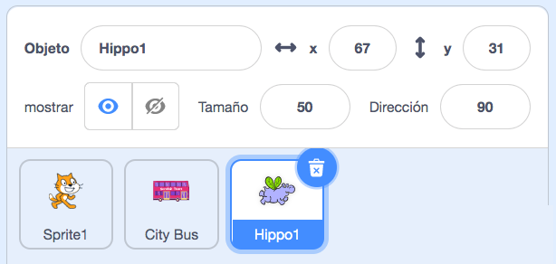

## El hipopótamo vuela hacia el autobús

<div style="display: flex; flex-wrap: wrap">
<div style="flex-basis: 200px; flex-grow: 1; margin-right: 15px;">
Agregarás un objeto de hipopótamo que vuela hacia el autobús.
</div>
<div>

! [El hipopótamo volando hacia el autobús.](Images / hippo-flies.png){: width = "300px"}

</div>
</div>

### Dale al Hipopótamo una posición inicial

--- task ---

Cambia el **Tamaño** del objeto **Hippo1** (Hipopótamo):

Agrega el objeto **Hippo1** (Hipopótamo) a tu proyecto.



--- /task ---

--- task ---

Arrastra al hipopótamo a la parte superior izquierda del escenario.


--- /task ---

--- task ---

Agrega código para llevar al hipopótamo a su posición inicial:

```blocks3
when flag clicked
go to x: [-200] y: [150] // top left-hand side
```

**Consejo:** Las coordenadas `x`{:class="block3motion"} e `y`{:class="block3motion"} en el bloque `ir a x: y:`{:class="block3motion"} serán la posición actual del hipopótamo, por lo que no es necesario que los cambies.

--- /task ---

### Haz que el Hipopótamo agite sus alas y vuele

--- task ---

Agrega código para hacer que el hipopótamo vuele hacia el **City Bus** (Autobús):

```blocks3
when flag clicked
go to x: [-200] y: [150] 
+repeat [100] 
point towards (City Bus v) // change from mouse-pointer
move [3] steps
next costume
+end
```

--- /task ---

--- task ---

**Prueba:** Haz clic en la bandera verde y comprueba que el hipopótamo vuela hacia el autobús. Puedes cambiar el número en el bloque `repetir`{:class="block3control"} hasta que el hipopótamo se detenga en el lugar correcto.

--- /task ---

### Muestra y oculta el autobús

--- task ---

Agrega los bloques `mostrar`{:class="block3looks"} y `ocultar`{:class="block3looks"}:

```blocks3
when flag clicked
go to x: [-200] y: [150] 
+ show
repeat [90] 
point towards (City Bus v)
move [3] steps
next costume
end
+ hide
```

--- /task ---

--- task ---

**Prueba:** Haz clic en la bandera verde. El hipopótamo volará y entrará en el autobús.

--- /task ---
